# Curso de PostgreSQL

- [Curso de PostgreSQL](#curso-de-postgresql)
  - [Modulo 1 Configurar Postgres](#modulo-1-configurar-postgres)
    - [Clase 1 Introduccion](#clase-1-introduccion)
    - [Clase 2 Que es Postgresql](#clase-2-que-es-postgresql)
    - [Clase 3 Instalacion y configuración de la Base de Datos](#clase-3-instalacion-y-configuración-de-la-base-de-datos)
    - [Clase 4 Interacción con Postgres desde la Consola](#clase-4-interacción-con-postgres-desde-la-consola)
      - [Comandos importantes PostgreSQL](#comandos-importantes-postgresql)
    - [Clase 5 PgAdmin: Interaccion con Postgres desde la Interfaz Grafica](#clase-5-pgadmin-interaccion-con-postgres-desde-la-interfaz-grafica)
    - [Clase 6 Archivos de Configuracion](#clase-6-archivos-de-configuracion)
    - [Clase 7 Comandos mas utilizados en PostgreSQL](#clase-7-comandos-mas-utilizados-en-postgresql)
      - [Comandos de ayuda](#comandos-de-ayuda)
      - [Comandos de navegacion y consulta de informacion](#comandos-de-navegacion-y-consulta-de-informacion)
      - [Comandos de inspeccion y ejecucion](#comandos-de-inspeccion-y-ejecucion)
      - [Comandos para debug y optimizacion](#comandos-para-debug-y-optimizacion)
      - [Comandos para cerrar la consola](#comandos-para-cerrar-la-consola)
      - [Ejecutando consultas en la base de datos usando la consola](#ejecutando-consultas-en-la-base-de-datos-usando-la-consola)
    - [Clase 8 Presentación del Proyecto](#clase-8-presentación-del-proyecto)
    - [Clase 9 Tipos de Datos](#clase-9-tipos-de-datos)
    - [Clase 10 Diseñando nuestra base de datos: estructura de las tablas](#clase-10-diseñando-nuestra-base-de-datos-estructura-de-las-tablas)
    - [Clase 11 Jerarquia de Bases de Datos](#clase-11-jerarquia-de-bases-de-datos)
  - [Modulo 2 Gestión de la información en bases de datos](#modulo-2-gestión-de-la-información-en-bases-de-datos)
    - [Clase 12 Creación de Tablas](#clase-12-creación-de-tablas)
    - [clase 13 Particiones](#clase-13-particiones)
    - [Clase 14 Creacion de Roles](#clase-14-creacion-de-roles)
      - [Creando roles desde SQL Shell](#creando-roles-desde-sql-shell)
      - [Creando roles desde PGAdmin](#creando-roles-desde-pgadmin)
    - [Clase 15 Llaves foraneas](#clase-15-llaves-foraneas)
    - [Clase 16 Insercion y consulta de datos](#clase-16-insercion-y-consulta-de-datos)
    - [Clase 17 Insercion masiva de datos](#clase-17-insercion-masiva-de-datos)
  - [Modulo 3 Generar consultas avanzadas](#modulo-3-generar-consultas-avanzadas)
    - [Clase 18 Cruzar tablas: SQL JOIN](#clase-18-cruzar-tablas-sql-join)
    - [Clase 19 Funciones Especiales Principales](#clase-19-funciones-especiales-principales)
    - [Clase 20 Funciones Especiales Avanzadas](#clase-20-funciones-especiales-avanzadas)
    - [Clase 21 Vistas](#clase-21-vistas)
      - [Vista volatil](#vista-volatil)
      - [Vista Materializada](#vista-materializada)
    - [Clase 22 PL/SQL](#clase-22-plsql)
      - [Creando funciones con PL](#creando-funciones-con-pl)
      - [Creando funciones con PGAdmin](#creando-funciones-con-pgadmin)
    - [Clase 23 Triggers](#clase-23-triggers)
  - [Modulo 4 Integrar bases de datos con servicios externos](#modulo-4-integrar-bases-de-datos-con-servicios-externos)
    - [Clase 24 Simulando una conexion a Bases de Datos remotas](#clase-24-simulando-una-conexion-a-bases-de-datos-remotas)
    - [Clase 25 Transacciones](#clase-25-transacciones)
    - [Clase 26 Otras Extensiones para Postgres](#clase-26-otras-extensiones-para-postgres)
  - [Modulo 5 Implementar mejores prácticas](#modulo-5-implementar-mejores-prácticas)
    - [Clase 26 Backups y Restauracion](#clase-26-backups-y-restauracion)
    - [Clase 29 Mantenimiento](#clase-29-mantenimiento)
    - [Clase 29 Introduccion a Replicas](#clase-29-introduccion-a-replicas)
    - [Clase 30 Implementacion de Replicas en Postgres](#clase-30-implementacion-de-replicas-en-postgres)
      - [Configuracion Master](#configuracion-master)
      - [Configuracion Replica](#configuracion-replica)
    - [Clase 31 Otras buenas  Practicas](#clase-31-otras-buenas-practicas)

## Modulo 1 Configurar Postgres

### Clase 1 Introduccion

Introduccion por el profesor

### Clase 2 Que es Postgresql

Postgre es un motor de base de datos open source y usa el Objeto-Relacional, existen tres conceptos importantes acerca de las bases de datos

- lenguaje
- motor: Permite estructurar toda la información dentro de un servidor
- servidor

Esta base de datos cumple con el estándar ACID (reglas para bases de datos para tener buenas practicas)

**• A: Atomicity – Atomicidad** -> Separar las funciones desarrolladas en la BD como pequeñas tareas y ejecutarlas como un todo. Si alguna tarea falla se hace un rollback(Se deshacen los cambios)

**• C: Consistency – Consistencia** -> Todo lo que se desarrolló en base al objeto relacional. Los datos tienen congruencia (gracias a PK y FK)

**• I: Isolation – Aislamiento** -> Varias tareas ejecutándose al mismo tiempo dentro de la BD (o varias instancias)

**• D: Durability – Durabilidad** -> Puedes tener seguridad que la información no se perderá por un fallo catastrófico. PostgreSQL guarda la información en una Bitácora y luego guarda el cambio efectivo en la base de datos.

Por Que PostgreSQL

- Tipos de Datos
- Integridad de Datos
- Concurrencia, Rendimiento
- Fiabilidad, recuperación ante desastres
- Seguridad
- Extensibilidad
- Internacionalizacion
- Búsqueda de Texto
- Funciones com PostGIS y PL

### Clase 3 Instalacion y configuración de la Base de Datos

Vamos a instalar PostgreSQL en nuestra computadora. A continuación veremos el paso a paso y algunos consejos útiles para instalar y configurar correctamente PostgreSQL en nuestro equipo. En éste caso, usaremos Windows, pero los pasos son bastante similares entre los diferentes sistemas operativos.

Primer paso: ir a <https://www.postgresql.org/> y descargar la version acorde a tu sistema operativo, una vez dentro de esa seccion haz click en **download installer**.

Es altamente recomendable seleccionar la penúltima o antepenúltima versión. Si bien la última versión estable está disponible, en éste caso la 2.0, no es recomendable instalarla en nuestro equipo, ya que al momento de instalarla o usar un servicio en la Nube para Postgres, lo más seguro es que no esté disponible y sólo esté hasta la versión.5, que no es la última versión. Esto porque todos los proveedores de Infraestructura no disponen de la versión de Postgres más actual siempre (tardan un poco en apropiar los nuevos lanzamientos).

Si tienes un equipo con Linux, la instalación la puedes hacer directamente desde los repositorios de Linux, EDB ya no ofrece soporte para instaladores en Linux debido a que se ha vuelto innecesario, el repositorio de Linux con PostgreSQL ofrece una manera mucho más sencilla y estándar para instalar PostgreSQL en linux.

Segundo paso: descargamos la versión “Windows x86-64” (porque nuestro sistema operativo es de 64 bits). En caso de que tu equipo sea de 32 bits debes seleccionar la opción “Windows x86-32”.

Vamos a descargar la versión.5. Hacemos clic en Download y guardamos el archivo que tendrá un nombre similar a:
“postgresql-.5-2-windows-x64.exe”

Ahora vamos a la carpeta donde descargamos el archivo .exe, debe ser de aproximadamente 90 MB, lo ejecutamos.

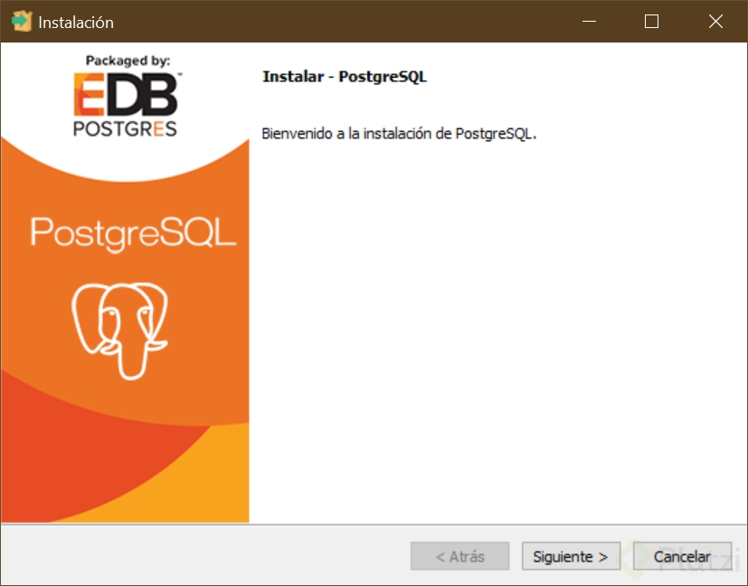

Hacemos clic en siguiente. Si deseas cambiar la carpeta de destino, ahora es el momento:


Seleccionamos los servicios que queremos instalar. En este caso dejamos seleccionados todos menos “Stack Builder”, pues ofrece la instalación de servicios adicionales que no necesitamos hasta ahora. Luego hacemos clic en siguiente:

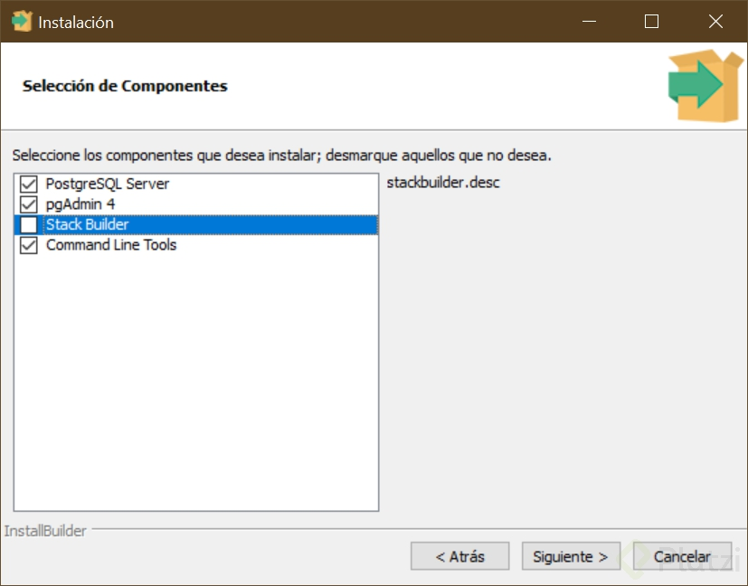

Ahora indicamos la carpeta donde iran guardados los datos de la base de datos, es diferente a la ruta de instalación del Motor de PostgreSQL, pero normalmente será una carpeta de nuestra carpeta de instalación. Puedes cambiar la ruta si quieres tener los datos en otra carpeta. Hacemos clic en siguiente.

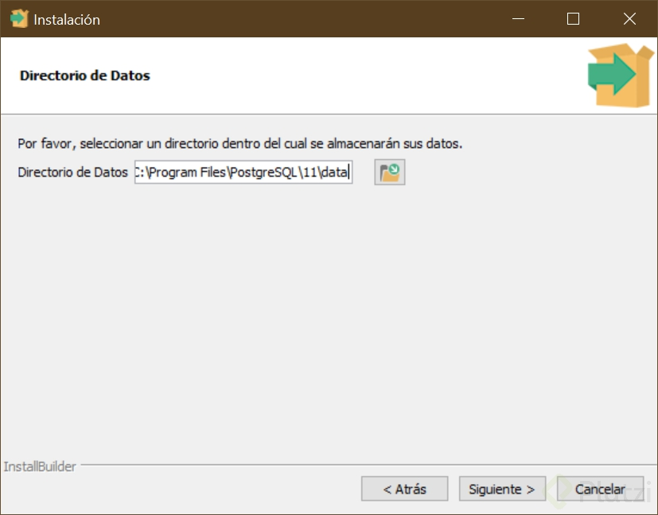

Ingresamos la contraseña del usuario administrador. De manera predeterminada, Postgres crea un usuario super administrador llamado **postgres** que tiene todos los permisos y acceso a toda la base de datos, tanto para consultarla como para modificarla. En éste paso indicamos la clave de ese usuario super administrador.

Debes ingresar una clave muy segura y guardarla porque la vas a necesitar después. Luego hacemos clic en siguiente.

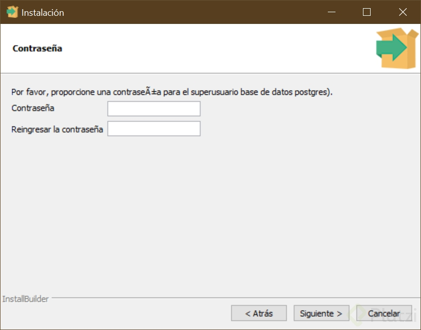

Ahora si queremos cambiar el puerto por donde el servicio de Postgresql estará escuchando peticiones, podemos hacerlo en la siguiente pantalla, si queremos dejar el predeterminado simplemente hacemos clic en siguiente.

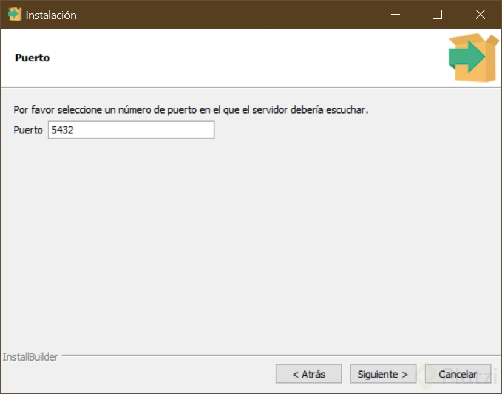

La configuración regional puede ser la predeterminada, no es necesario cambiarla, incluso si vamos a usarla en español, ya que las tildes y las eñes estarán soportadas si dejas la configuración regional predeterminada. Es útil cambiarla cuando quieras dejar de soportar otras funciones de idiomas y lenguajes diferentes a uno específico. Luego hacemos clic en siguiente:

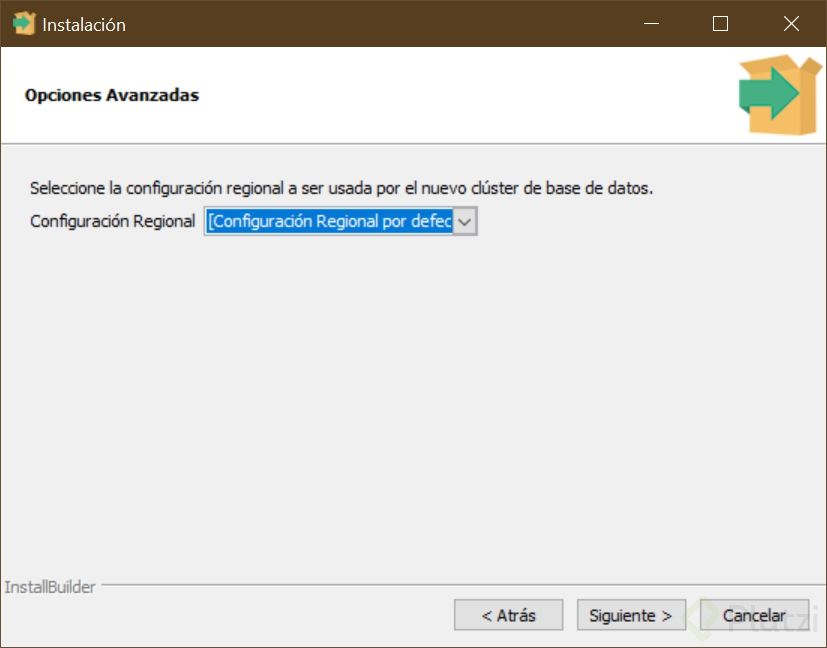

En pantalla aparecerá el resumen de lo que se va a instalar:

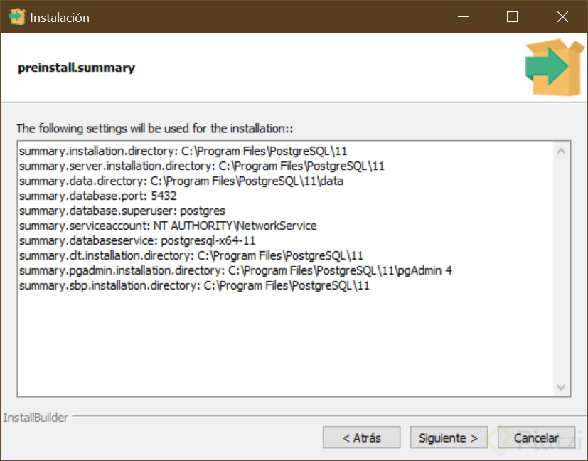

Al hacer clic en siguiente se muestra una pantalla que indica que PostgreSQL está listo para instalar, al hacer clic de nuevo en siguiente iniciará la instalación, espera un par de minutos hasta que la aplicación termine.

Una vez terminada la instalación, aparecerá en pantalla un mensaje mostrando que PostgreSQL ha sido instalado correctamente.

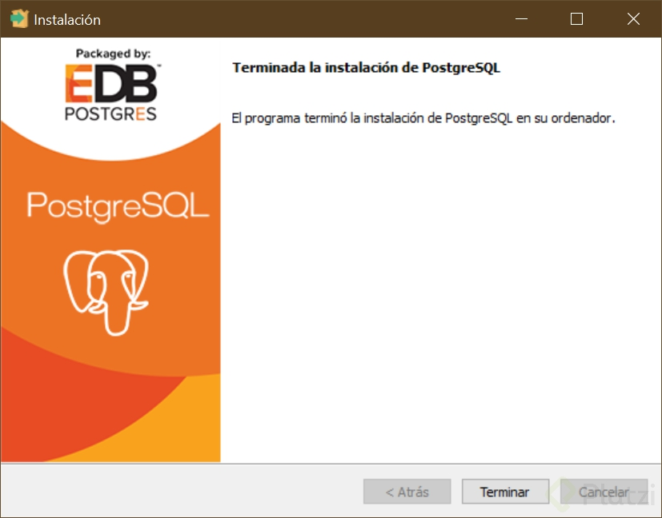

Podemos cerrar ésta pantalla y proceder a comprobar que todo quedó instalado correctamente.

Vamos a buscar el programa PgAdmin, el cual usaremos como editor favorito para ejecutar en él todas las operaciones sobre nuestra base de datos.

También vamos a buscar la consola… Tanto la consola como PgAdmin son útiles para gestionar nuestra base de datos, una nos permite ingresar comando por comandos y la otra nos ofrece una interfaz visual fácil de entender para realizar todas las operaciones.

En el menú de Windows (o donde aparecen instalados todos los programas) buscamos “PgAdmin…”


Ahora buscamos “SQL Shell…”


Efectivamente, ahora aparecen las herramientas que vamos a utilizar en éste curso.
Ahora vamos a crear una base de datos de prueba usando la consola y comprobaremos si existe usando PgAdmin, la crearemos para validar que la conexión con el servicio de base de datos interno funciona correctamente.

Para ello abrimos la consola, buscamos SQL Shell y lo ejecutamos. Veremos algo así:


Lo que vemos en pantalla es la consola esperando que ingresemos cada parámetro para la conexión.

Primero está el nombre del parámetro. En éste caso es “Server” seguido de unos corchetes que contienen el valor predeterminado. Si presionamos “Enter” sin digitar nada la consola asumirá que te refieres al valor predeterminado, si en éste caso presionamos “Enter” el valor asumido será “Localhost”. Localhost se refiere a nuestra propia máquina, si instalaste la base de datos en el mismo pc que estás usando para la consola, el valor correcto es Localhost o 27.0.0. (representan lo mismo).

Podemos dejar todos los valores predeterminados (presionando “Enter”) hasta que la consola pregunte por la clave del usuario maestro:


Debemos ingresar la clave que usamos cuando estábamos instalando Postgres, de lo contrario no podremos acceder. Presionamos Enter y veremos a continuación una pantalla que nos indica que estamos logueados en la base de datos y estamos listos para hacer modificaciones.

De manera predeterminada, la base de datos instalada es Postgres, la cual no debemos tocar, ya que ejecuta funciones propias del motor. Es usada por el Motor de PostgreSQL para interactuar con todas las bases de datos que vayamos a crear en el futuro.

La siguiente imagen indica que estamos conectados a la base de datos Postgres. Vamos a crear una base de datos nueva y luego saltar el cursor a ésta base de datos recién creada.


Para ello escribimos el comando “**CREATE DATABASE transporte_publico;**” y presionamos “Enter”. Veremos:


El mensaje **“CREATE DATABASE”** justo después de la línea que acabamos de escribir indica que la base de datos fue creada correctamente.

Para saltar a la base de datos recién creada ejecutamos el comando “**\c transporte_publico**”, el cursor mostrará lo siguiente:


Ahora vamos a validar desde PgAdmin que la base de datos fué creada correctamente. Abrimos PgAdmin y nos encontramos con una lista de items a la izquierda, lo que significa que de manera predeterminada PgAdmin ha creado un acceso a nuestra base de datos local, el cual llamó “PostgreSQL”:


Al hacer hacer doble clic sobre éste elemento (“PostgreSQL”) nos pedirá ingresar la clave que hemos determinado para el super usuario postgres, al igual que la consola, hasta no ingresarla correctamente no nos podremos conectar:


Ingresamos la clave. Te recomiendo seleccionar la opción “Save Password” o “Guardar Contraseña”. Si la máquina sobre la que estás trabajando es de confianza, que seas sólo tú o tu equipo quien tenga acceso a ella, de lo contrario, no guardes la contraseña para mantenerla segura.

Veremos la lista de bases de datos disponibles, la predeterminada “postgres” y la que acabamos de crear usando la consola, lo que comprueba que la base de datos y la consola funcionan correctamente.


Ahora procedemos a eliminar la base de datos recién creada para comprobar que PgAdmin está correctamente configurada y si pueda realizar cambios sobre la base de datos.

Para ello hacemos clic derecho sobre el elemento “transporte_publico” y seleccionamos la opción “Delete/Drop”. Al mensaje de confirmar hacemos clic en OK.

Con ello, si el elemento “transporte_publico” desaparece del menú de la izquierda comprobamos que PgAdmin funcionan correctamente.

### Clase 4 Interacción con Postgres desde la Consola

Vamos a aprender los comandos mas útiles en la shell, al iniciar siempre encontramos los siguientes puntos

Server [localhost]: valor predeterminado o del server al que queremos conectarnos

Database [postgres]: Escribe aquí la base de datos a la que quieres ingresar o enter para la predeterminada

Port [5432]: Idem conceptos anteriores

Username [postgres]: Idem conceptos anteriores

Contraseña para usuario postgres:

#### Comandos importantes PostgreSQL

- **\l**: lista las bases de datos del sistema (siempre va a haber por default 3 bases de datos propias de postgre + las que agreguemos).

- **\dt**" muestra las tablas de la base de datos de postgresql

- **\c + nombre base de datos**: usar una base de datos

- **\d + nombre tabla consultar**: describe el contenido de una tabla especifica.

- **\h SELECT**: ayuda para funciones estándar SQL.

- **SELECT version();**: ver la version de PostgreSQL

- **\g** permite volver a ejecutar la funcion previa ejecutada en consola (repetir lo anterior).

- **\timing**: muestra el tiempo de ejecución de un comando, algo muy importante para las optimizaciones.

### Clase 5 PgAdmin: Interaccion con Postgres desde la Interfaz Grafica

Esta clase retoma los comandos anteriores del shell ahora con la interfaz grafica.

Para conectarnos tenemos el item PostgreSQL(   ), a diferencia de la shell PGAdmin permite hacer cosas custom como colores y tags.

Creamos una base de datos propia usando la parte de server del arbol del admin.

En el dashboard podemos observar como Postgres usa el mismo motor de forma redundante para hacerse consultas a si mismo y saber que esta pasando en el entorno de ejecución para esta base de datos.

En la parte del Admin en Server podemos crear una base de datos  desde cero a partir del servidor y conectarla al localhost o a una base de datos alojada en un server local o remoto.

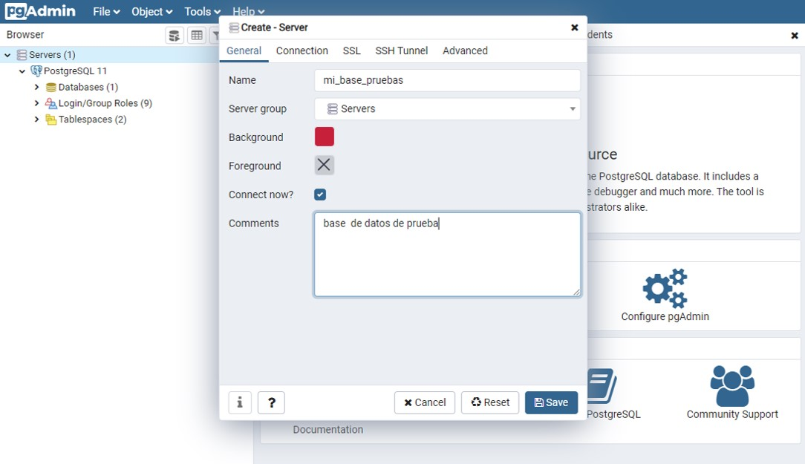

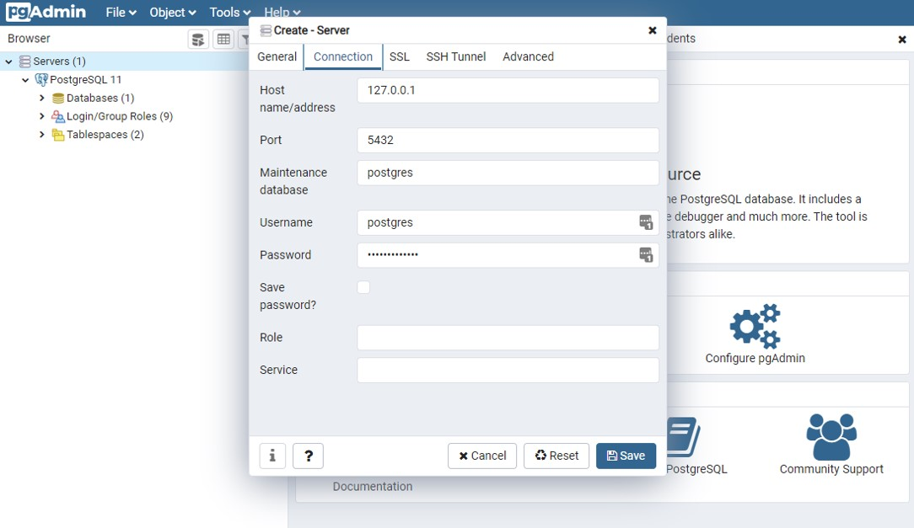

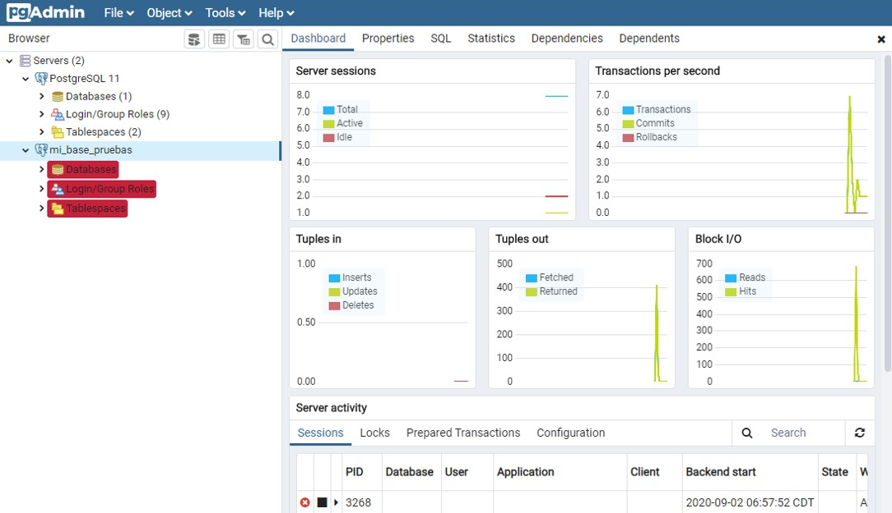

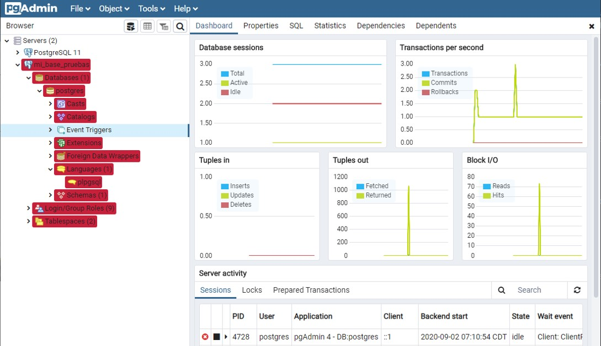

Podemos usar en el menu de  tools el Query tools

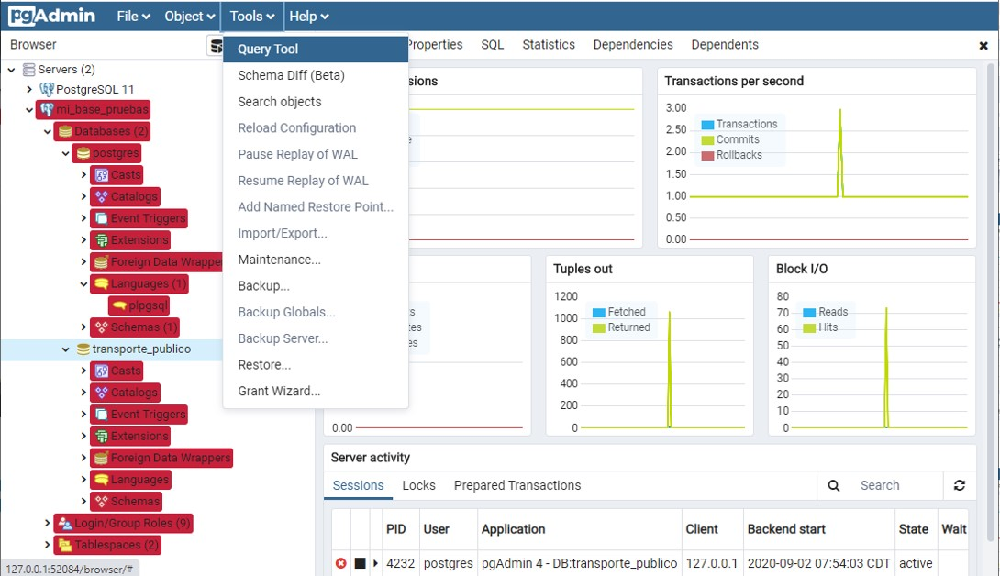

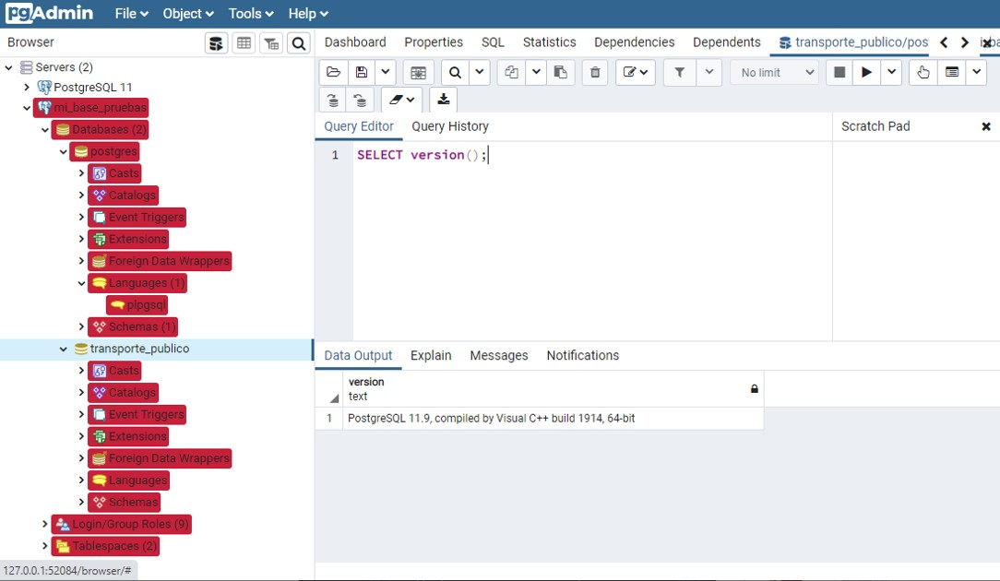

### Clase 6 Archivos de Configuracion

Antes de crear tablas o hacer diseños es importante conocer 3 archivos de configuracion que muchas veces son el origen de los problemas cuando estamos agregando nuevos servicios o configurando la base de datos

Los archivos de configuración son tres principales:

- **postgreql.conf**: en este archivo podemos cambiar puerto, numero de conexiones maxima, accesos para ip únicas. (un pro en bases de datos siempre ha leído todo el documento). En este archivo también se encuentra la información de las replicas

- **pg.hba.conf**: contiene los roles, tipos de usuarios, permisos, direcciones, métodos de acceso con MD5, también puedo negar a otros hosts a conectarnos,este archivo es muy importante dado que nos permite no solo dar acceso a usuarios y a las replicas sino protegernos de ataques o personas mal intencionados

- **pg_ident.conf**

La ruta de los mismos depende del sistema Operativo, para saber que que ruta están, basta con hacer una Query

**SHOW config_file**;

NOTA: siempre es bueno hacer una copia original de los archivos antes de modificarlos por si movemos algo que no.

### Clase 7 Comandos mas utilizados en PostgreSQL

La consola en PostgreSQL es una herramienta muy potente para crear, administrar y depurar nuestra base de datos. podemos acceder a ella después de instalar PostgreSQL y haber seleccionado la opción de instalar la consola junto a la base de datos.

PostgreSQL está más estrechamente acoplado al entorno UNIX que algunos otros sistemas de bases de datos, utiliza las cuentas de usuario nativas para determinar quién se conecta a ella (de forma predeterminada). El programa que se ejecuta en la consola y que permite ejecutar consultas y comandos se llama psql, psql es la terminal interactiva para trabajar con PostgreSQL, es la interfaz de línea de comando o consola principal, así como PgAdmin es la interfaz gráfica de usuario principal de PostgreSQL.

Después de emitir un comando PostgreSQL, recibirás comentarios del servidor indicándote el resultado de un comando o mostrándote los resultados de una solicitud de información. Por ejemplo, si deseas saber qué versión de PostgreSQL estás usando actualmente, puedes hacer lo siguiente:

```sql
SELECT version()

```

#### Comandos de ayuda

En consola los dos principales comandos con los que podemos revisar el todos los comandos y consultas son:

**\?** Con el cual podemos ver la lista de todos los comandos disponibles en consola, comandos que empiezan con backslash()

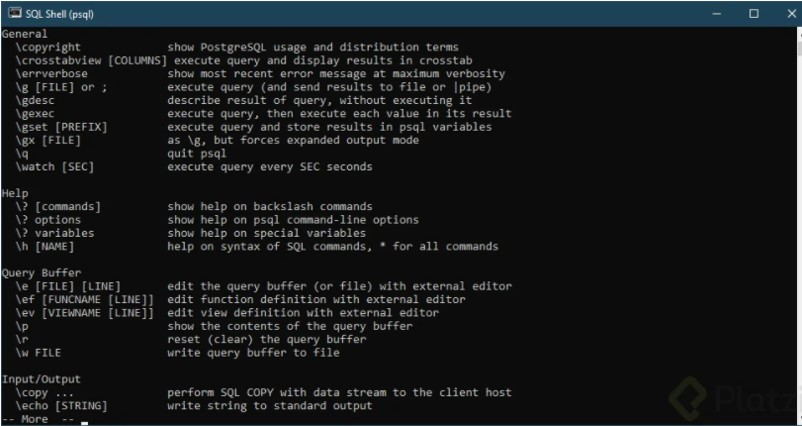

**\h** Con este comando veremos la información de todas las consultas SQL disponibles en consola. Sirve también para buscar ayuda sobre una consulta específica, para buscar información sobre una consulta específica basta con escribir \h seguido del inicio de la consulta de la que se requiera ayuda, así: \h ALTER

De esta forma podemos ver toda la ayuda con respecto a la consulta ALTER

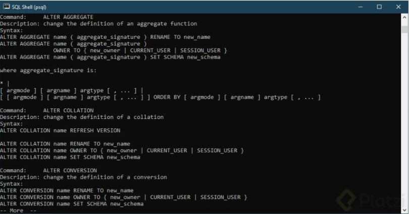

#### Comandos de navegacion y consulta de informacion

**\c** Saltar entre bases de datos

**\l** Listar base de datos disponibles

**\dt** Listar las tablas de la base de datos

**\d <nombre_tabla>** Describir una tabla

**\dn** Listar los esquemas de la base de datos actual

**\df** Listar las funciones disponibles de la base de datos actual

**\dv** Listar las vistas de la base de datos actual

**\du** Listar los usuarios y sus roles de la base de datos actual

#### Comandos de inspeccion y ejecucion

**\g** Volver a ejecutar el comando ejecutando justo antes

**\s** Ver el historial de comandos ejecutados

**\s <nombre_archivo>** Si se quiere guardar la lista de comandos ejecutados en un archivo de texto plano

**\i <nombre_archivo>** Ejecutar los comandos desde un archivo

**\e** Permite abrir un editor de texto plano, escribir comandos y ejecutar en lote. \e abre el editor de texto, escribir allí todos los comandos, luego guardar los cambios y cerrar, al cerrar se ejecutarán todos los comandos guardados.

**\ef** Equivalente al comando anterior pero permite editar también funciones en PostgreSQL\

#### Comandos para debug y optimizacion

**\timing** Activar / Desactivar el contador de tiempo por consulta

#### Comandos para cerrar la consola

**\q** Cerrar la consola

#### Ejecutando consultas en la base de datos usando la consola

De manera predeterminada PostgreSQL no crea bases de datos para usar, debemos crear nuestra base de datos para empezar a trabajar, verás que existe ya una base de datos llamada **postgres** pero no debe ser usada ya que hace parte del CORE de PostgreSQL y sirve para gestionar las demás bases de datos.

Para crear una base de datos debes ejecutar la consulta de creación de base de datos, es importante entender que existe una costumbre no oficial al momento de escribir consultas; consiste en poner en mayúsculas todas las palabras propias del lenguaje SQL cómo **CREATE**, **SELECT**, **ALTER**, etc y el resto de palabras como los nombres de las tablas, columnas, nombres de usuarios, etc en minúscula. No está claro el porqué de esta especie de “estándar” al escribir consultas SQL pero todo apunta a que en el momento que SQL nace, no existían editores de consultas que resaltaran las palabras propias del lenguaje para diferenciar fácilmente de las palabras que no son parte del lenguaje, por eso el uso de mayúsculas y minúsculas.

Las palabras reservadas de consultas SQL usualmente se escriben en mayúscula, ésto para distinguir entre nombres de objetos y lenguaje SQL propio, no es obligatorio, pero podría serte útil en la creación de Scripts SQL largos.

Vamos ahora por un ligero ejemplo desde la creación de una base de datos, la creación de una tabla, la inserción, borrado, consulta y alteración de datos de la tabla.

Primero crea la base de datos, **“CREATE DATABASE transporte;”** sería el primer paso.

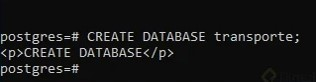

Ahora saltar de la base de datos **postgres** que ha sido seleccionada de manera predeterminada a la base de datos transporte recién creada utilizando el comando \c transporte.

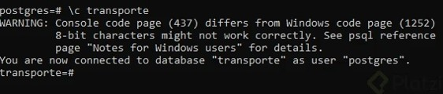

Ahora vamos a crear la tabla tren, el SQL correspondiente sería:

```sql
CREATE TABLE tren ( id serial NOT NULL, modelo character varying, capacidad integer, CONSTRAINT tren_pkey PRIMARY KEY (id) );
```

La columna id será un número autoincremental (cada vez que se inserta un registro se aumenta en uno), modelo se refiere a una referencia al tren, capacidad sería la cantidad de pasajeros que puede transportar y al final agregamos la llave primaria que será id.

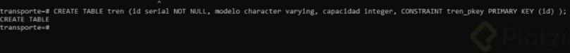

Ahora que la tabla ha sido creada, podemos ver su definición utilizando el comando `\d tren`

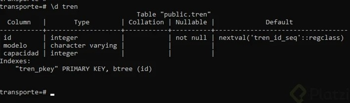

PostgreSQL ha creado el campo id automáticamente cómo integer con una asociación predeterminada a una secuencia llamada ‘tren_id_seq’. De manera que cada vez que se inserte un valor, id tomará el siguiente valor de la secuencia, vamos a ver la definición de la secuencia. Para ello, \d `tren_id_seq` es suficiente:

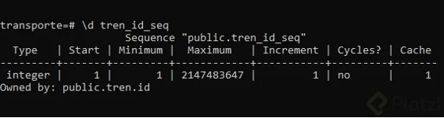

Vemos que la secuencia inicia en uno, así que nuestra primera inserción de datos dejará a la
columna id con valor uno.

```sql
INSERT INTO tren( modelo, capacidad ) VALUES (‘Volvo ’, 00);
```

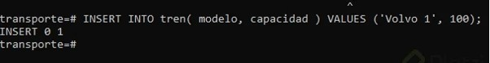

```sql
SELECT * FROM tren;
```

Consultamos ahora los datos en la tabla:

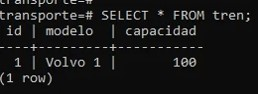

Vamos a modificar el valor, establecer el tren con id uno que sea modelo Honda 0726. Para ello ejecutamos la consulta tipo **UPDATE tren SET modelo = 'Honda 0726' Where id = 1**;


Verificamos la modificación **SELECT * FROM tren;**


Ahora borramos la fila: **DELETE FROM tren WHERE id = ;**


Verificamos el borrado **SELECT * FROM tren;**


El borrado ha funcionado tenemos 0 rows, es decir, no hay filas. Ahora activemos la herramienta que nos permite medir el tiempo que tarda una consulta **\timing**


Probemos cómo funciona al medición realizando la encriptación de un texto cualquiera usando el algoritmo md5:


La consulta tardó 0.0mili-segundos

Ahora que sabes como manejar algunos de los comandos más utilizados en PostgreSQL es momento de comenzar a practicar!!!

### Clase 8 Presentación del Proyecto

El proyecto consiste en el modelado de un sistema de transporte de personas mediante trenes.

Reto

- Pasajero
- Trayecto
- Estación
- Tren
- Viaje

### Clase 9 Tipos de Datos

PostgreSQL soporta los siguientes tipos de datos

Principales y comunes en SQL:

- Numéricos(Números enteros, Números Decimales, Seriales)
- Monetarios(cantidad de moneda)
- Texto(almacenar cadenas y texto, existen tres VARCHAR, CHAR, TEXT)
- Binario(1 Y 0)
- Fecha/Hora(Para almacenar Fechas y/o Horas, DATE TYPE, TIME TYPE, TIMESTAMP, INTERVAL)
- Boolean(Verdadero o Falso)

Especiales propios de postgres

- Geométricos: Permiten calcular distancias y áreas usando dos valores X y Y.
- Direcciones de Red: Cálculos de máscara de red
- Texto tipo bit: Cálculos en otros sistemas, ejm(hexadecimal, binario)
XML, JSON: Postgres no permite guardar en estos formatos
- Arreglos: Vectores y Matrices

### Clase 10 Diseñando nuestra base de datos: estructura de las tablas

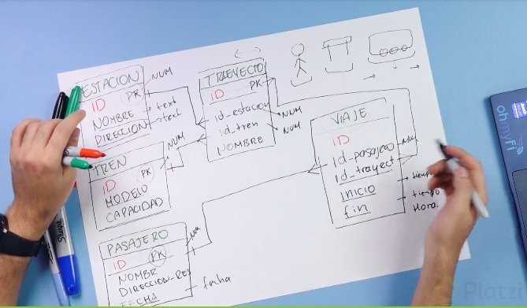

### Clase 11 Jerarquia de Bases de Datos

Toda jerarquía de base de datos se basa en los siguientes elementos:

- **Servidor de base de datos:** Computador que tiene un motor de base de datos instalado y en ejecución.

- **Motor de base de datos:** Software que provee un conjunto de servicios encargados de administrar una base de datos.

- **Base de datos:** Grupo de datos que pertenecen a un mismo contexto.

- **Esquemas de base de datos en PostgreSQL:** Grupo de objetos de base de datos que guarda relación entre sí (tablas, funciones, relaciones, secuencias).

- **Tablas de base de datos:** Estructura que organiza los datos en filas y columnas formando una matriz.

**PostgreSQL es un motor de base de datos**.

La estructura de la base de datos diseñada para el reto corresponde a los siguientes
elementos:

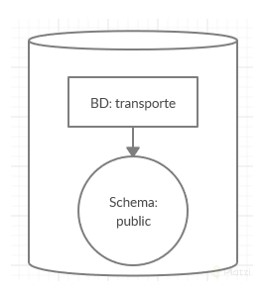

La base de datos se llama transporte, usaremos su esquema predeterminado public.

El esquema public contiene las siguientes tablas:

- Estación
- Pasajero
- Tren

Y las tablas de relaciones entre cada uno de los elementos anteriores son:

- Trayecto
- Viaje

El esquema relacional entre las tablas corresponde al siguiente diagrama:

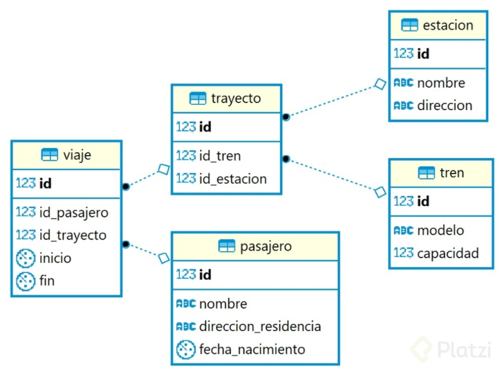

**Estación**
Contiene la información de las estaciones de nuestro sistema, incluye datos de nombre con tipo de dato texto y dirección con tipo de dato texto, junto con un número de identificación único por estación.

**Tren**
Almacena la información de los trenes de nuestro sistema, cada tren tiene un modelo con tipo de dato texto y una capacidad con tipo de dato numérico que representa la cantidad de personas que puede llevar ese tren, también tiene un ID único por tren.

**Trayecto**
Relaciona los trenes con las estaciones, simula ser las rutas que cada uno de los trenes pueden desarrollar entre las estaciones

**Pasajero**
Es la tabla que contiene la información de las personas que viajan en nuestro sistema de transporte masivo, sus columnas son nombre tipo de dato texto con el nombre completo de la persona, dirección_residencia con tipo de dato texto que indica dónde vive la persona, fecha_nacimiento tipo de dato texto y un ID único tipo de dato numérico para identificar a cada persona.

**Viaje**
Relaciona Trayecto con Pasajero ilustrando la dinámica entre los viajes que realizan las personas, los cuales parten de una estación y se hacen usando un tren.

## Modulo 2 Gestión de la información en bases de datos

### Clase 12 Creación de Tablas

Las tablas en PostgreSQL siguen el estándar SQL para las tablas

- CREATE
- ALTER
- DROP

**Creación una base de datos en pgAdmin**.

En el arbol del server damos click derecho en nuestra BD_PRUEBAS/databases en la opcion CREATE y asignamos un nombre.

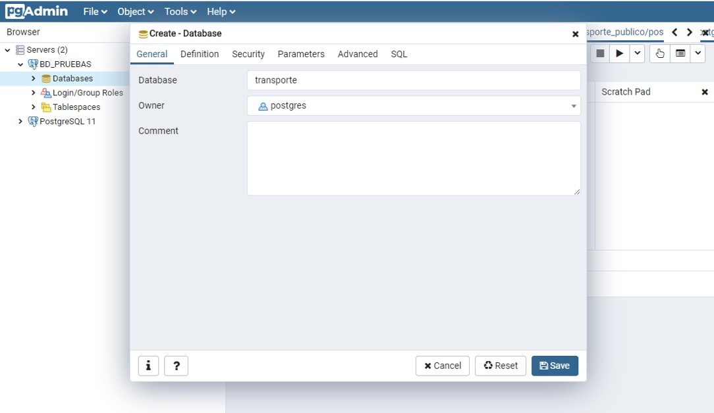

PGAdmin también nos muestra la sentencia que ejecutara por debajo en consola.

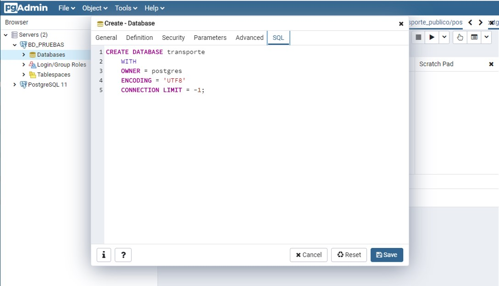

Se crea todo el arbol relacionado a la base de datos, dentro de este se encuentran los Schemas, de manera predeterminada se crea el Schema public en el vamos a crear nuestra primera tabla

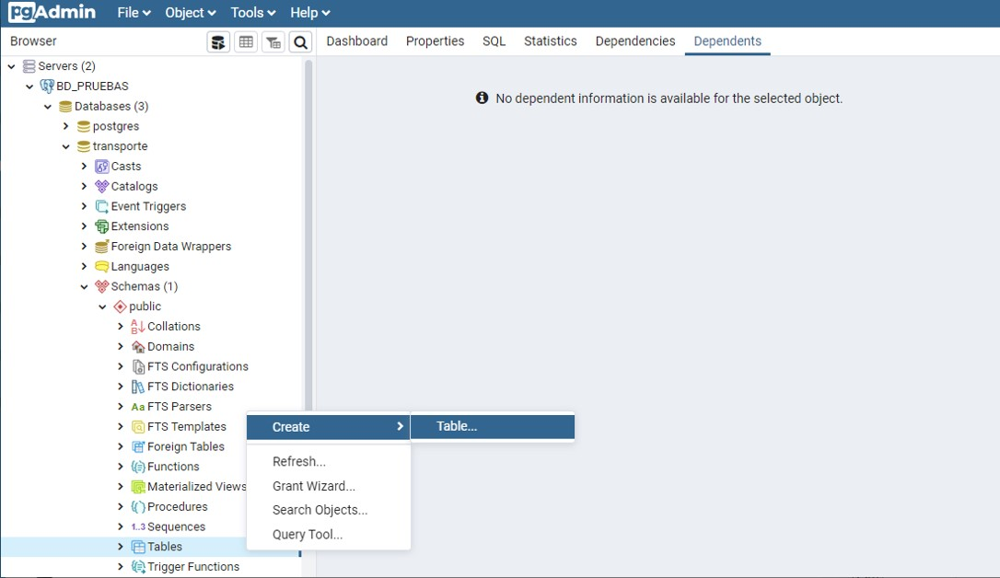

Le asignamos el nombre de pasajero (aunque como practica común las tablas se nombren en plural)

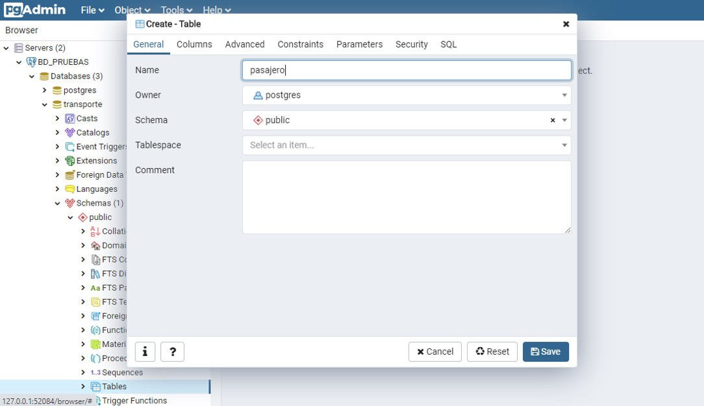

Y creamos las columnas definidas en nuestro diagrama entidad-relacion

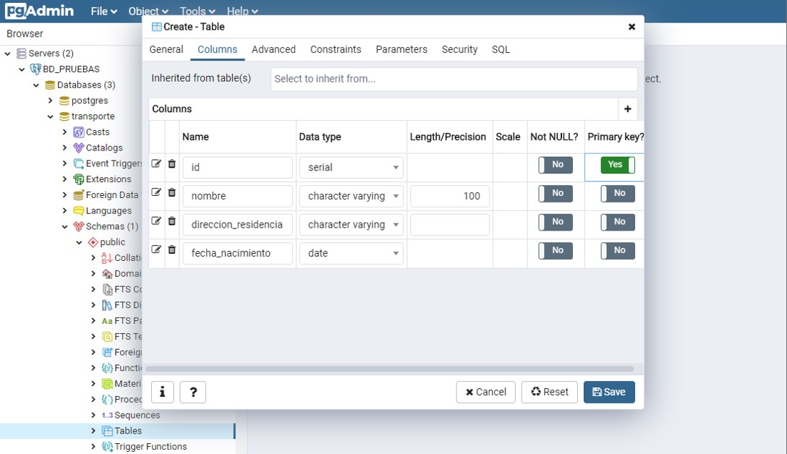

Nota:

**Serial** es un tipo de dato de postgreSQL y corresponde a un tipo de dato Integer Autoincremental.

**Character Varying** es un tipo de dato similar a Varchar en otros manejadores, si no estamos seguros de la longitud podemos dejar el area vacía.

**Date** Corresponde a fechas.

Ahora definimos los constraints para definir nuestra llave primaria, el **estándar de postgres** es **nombre_de_la_tabla_pkey**

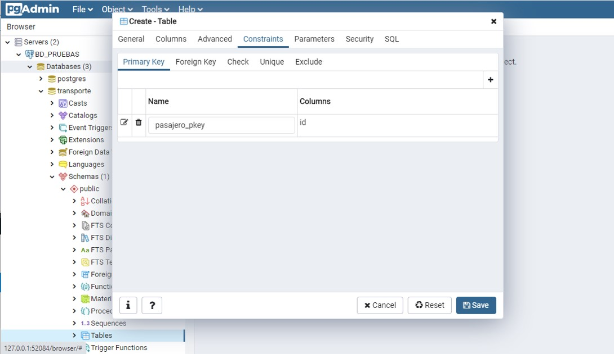

Al final podemos ver la sentencia SQL y guardamos nuestra tabla.

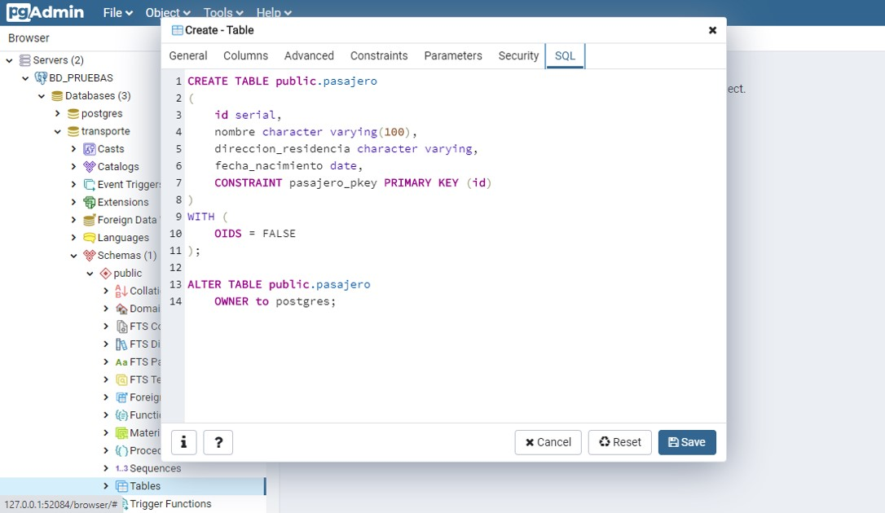

Con ello creamos la tabla pasajero, ahora usaremos PGAdmin para crear el script de inserción dando click derecho a la tabla y seleccionando insert, esto crear el script automáticamente para (INSERT INTO de SQL) agregar los datos.

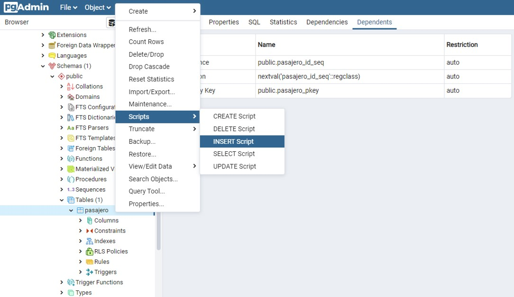

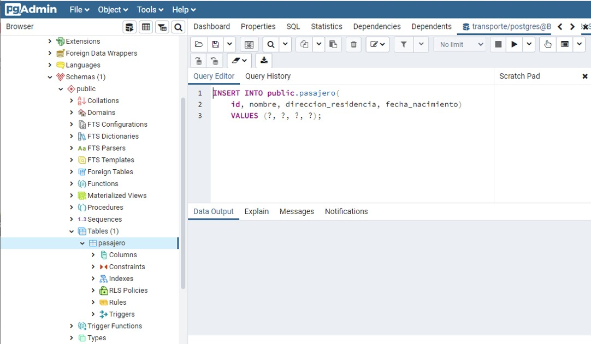

Borramos **id** por ser autoincremental

Para obtener la fecha actual escribimos y saber en que formato insertar los datos

```sql
SELECT current_date;
```

Insertamos el registro seleccionado solo el query a realizar y usamos el boten de play o F5.


Podemos verificar que los datos yendo a los query tools y hacemos la consulta de la tabla.

**Reto:** crear las tablas faltantes del diagrama entidad-relacion.

Aquí los scripts del reto

```sql
-- Crear tabla tren
CREATE TABLE public.tren
(
id serial,
modelo character varying(20),
capacidad character varying,
CONSTRAINT tren_pkey PRIMARY KEY (id)
)
WITH (
OIDS = FALSE
);

ALTER TABLE public.tren
OWNER to postgres;


-- Crear tabla estacion
CREATE TABLE public.estacion
(
id serial,
nombre character varying,
direccion character varying,
CONSTRAINT estacion_pkey PRIMARY KEY (id)
)
WITH (
OIDS = FALSE
);

ALTER TABLE public.estacion
OWNER to postgres;

-- Crear tabla trayecto
CREATE TABLE public.trayecto
(
id serial,
id_estacion integer,
id_tren integer,
nombre character varying,
CONSTRAINT trayecto_pkey PRIMARY KEY (id)
)
WITH (
OIDS = FALSE
);

-- Crear tabla trayecto
ALTER TABLE public.trayecto
OWNER to postgres;

CREATE TABLE public.viaje
(
id serial,
id_pasajero integer,
id_trayecto integer,
inicio date,
fin date,
CONSTRAINT viaje_pkey PRIMARY KEY (id)
)
WITH (
OIDS = FALSE
);

ALTER TABLE public.viaje
OWNER to postgres;
```

### clase 13 Particiones

En ocasiones llega un punto en elq ue tienes mucha informacion en una sola tabla, y al momento de consultarla la base de datos tendrá que hacer el recorrido de toda la informacion para encontrar el contenido que estas buscando.

Imagina que nuestra tabla de viajes tiene cien mil registros, y que quieres consultar los viajes realizados en un rango de fechas, esa consulta ocupara un espacio en memoria que deberá ser leída para obtener la respuesta, en este punto entran las particiones.

Las particiones tiene como ventaja lo siguiente:

- Separación física de datos
- Conservan la Estructura Lógica

La separacion física hace referencia a que es posible guardar varias parte de la misma tabla en diferentes espacios de disco o incluso en otros discos, internamente Postgre usando el mismo nombre de la tabla asigna otras pequeñas tablas que tienen un rango definido, en nuestro caso le diríamos que el rango son las fechas o las horas, por ejemplo una partición para junio, otra para julio y al hacer la consulta con el mismo **SELECT** de siempre Postgre buscaría la informacion solo en la partición correspondiente, esto reduce el tiempo de ejecucion de la consulta y a su vez evita que la tabla se bloquee al ser consultada o escrita demasiadas veces en periodos de tiempo cortos.

En esta clase vamos a crear una tabla, asignarle particiones y después hacer un **INSERT** común y corriente y hacer una consulta común y corriente con pgAdmin.

Creamos la tabla bitacora_viaje con toda la informacion de los viajes tendra los campos id, id_viaje, fecha, fecha sera el campo por el cual vamos a particionar la tabla.

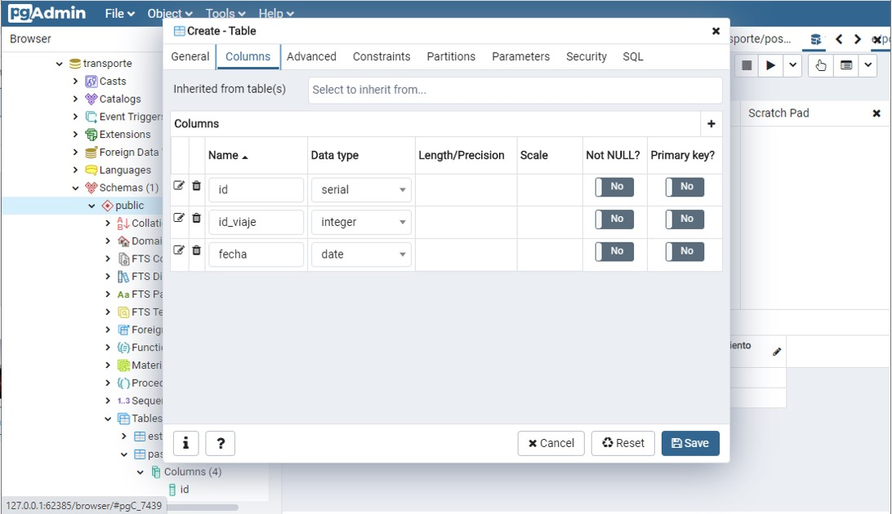

**Como lo hacemos?**

Primero indicamos a la tabla que haremos la partición y luego por cual campo seria, para después agregar cada una de las particiones por separado para ello iremos al apartado **Partition**.

Dejamos constraints vacío, y en General indicamos que es una tabla particionada.

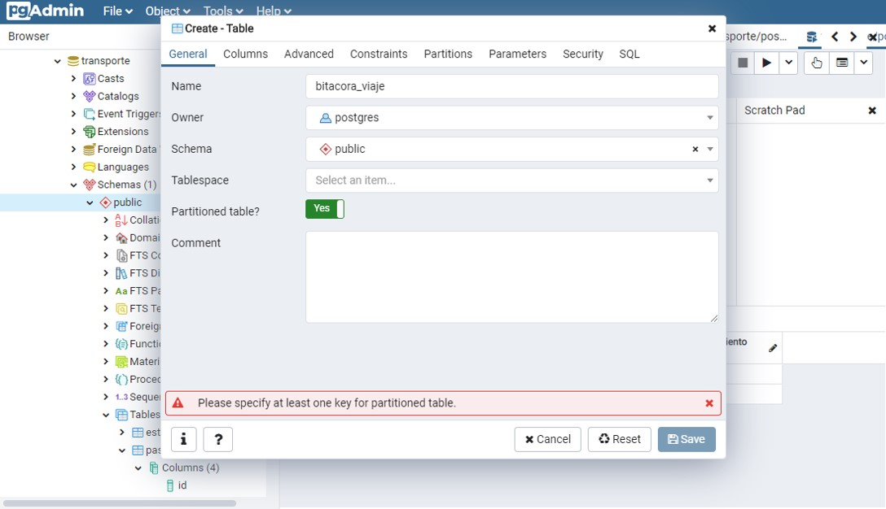

Con ello nos pide una llave para hacer la partición, la asignamos en la tabla partitions

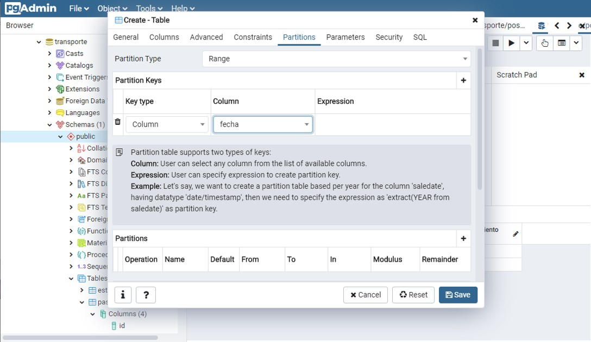

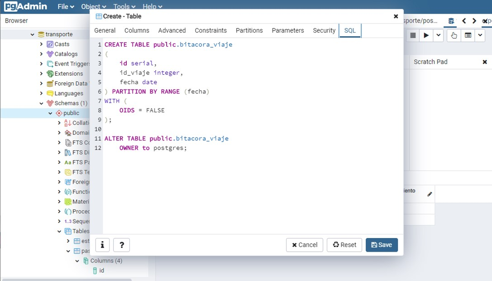

Creamos un **INSERT**  para dicha tabla.

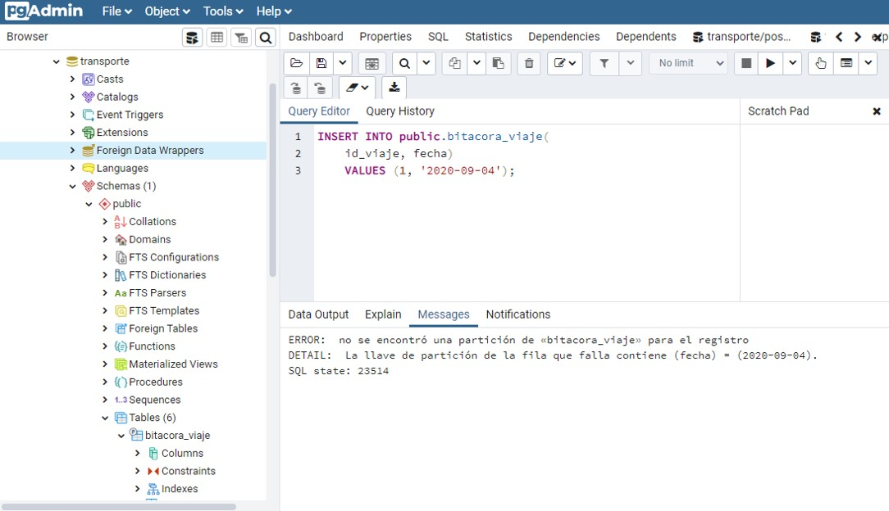

Observamos el error al no existir ninguna partición, ahora hay que crearla, esto lo hacemos creando una nueva tabla

```sql
CREATE TABLE bitacora_viaje_200_0 PARTITION OF bitacora_viaje
FOR VALUES FROM ('200-0-0') TO ('209-0-3')
```

Creamos la tabla de partición para 200 del mes de enero ahora todos los **INSERT** correspondientes a ese rango de tiempo se guardaran en esa tabla.


Ejecutamos el INSERT con un rango de la partición.

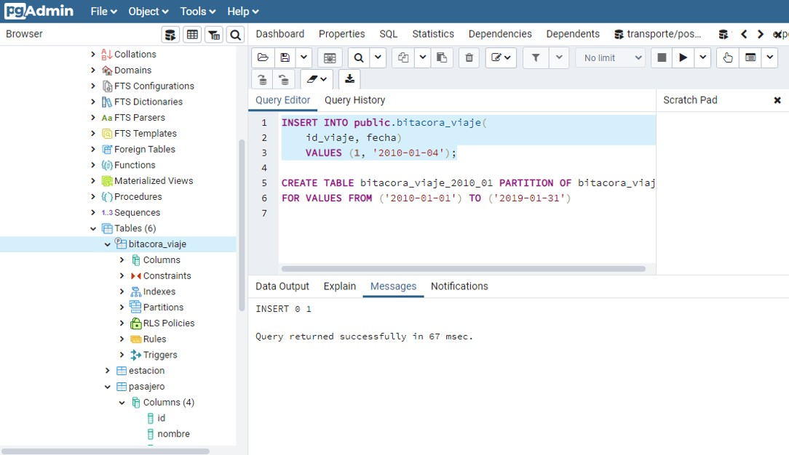

 Pero en contraste de que si queremos insertar datos fuera de ese rango de tiempo la operación nos arrojara un error como al principio, por lo tanto tendremos que crear una nueva partición.

Observa que las particiones si existen físicamente.

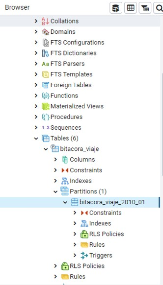

Nota final, no es posible crear llaves primarias en tablas particionadas ya que la informacion esta toda dividas, no te preocupes estas tablas se utilizan para guardar informacion en masa como bitácoras y hacen referencia a tablas que si tienen estas llaves primarias (miralo como un pivot table)

Si vas a crear un proyecto donde tengas informacion histórica es buena practica iniciarla como una tabla particionada para mejorar el performance de nuestra aplicación

En mi ejemplo use un rango de 9 años de 200 a 209, pero si la data es enorme podemos hacer particiones en unidades de meses, semanas o dias.

Una vez aprendido este concepto borramos la tabla, ya que no es necesaria para el proyecto.

### Clase 14 Creacion de Roles

Hemos creado la tablas, ahora debemos mirar los roles, estos igual que las tablas tienen la capacidad de ser creados y eliminados, sin embargo tiene las siguientes caracteristicas especiales.

- Crear y eliminar otros roles
- Asignar atributos
- Agrupar con otros roles (conjunto global de permisos)
- Roles predeterminados
- Son independientes de las bases de datos

Hasta ahora hemos estado utilizando el usuario predeterminado de postgres, lo cual sabemos que es muy peligroso ya que al ser un usuario de tipo root este tiene todos los privilegios para borrar todo, lo ideal es crear un usuario para trabajar con los roles y permisos adecuados.

#### Creando roles desde SQL Shell

Crearemos un rol con la terminal que tenga la capacidad de hacer login

```sql
\H CREATE ROLE

CREATE ROLE nombre [ [ WITH ] opción [ ... ] ]

donde opción puede ser:

 SUPERUSER | NOSUPERUSER
| CREATEDB | NOCREATEDB
| CREATEROLE | NOCREATEROLE
| INHERIT | NOINHERIT
| LOGIN | NOLOGIN
| REPLICATION | NOREPLICATION
| BYPASSRLS | NOBYPASSRLS
| CONNECTION LIMIT limite_conexiones
| [ ENCRYPTED ] PASSWORD 'contraseña' | PASSWORD NULL
| VALID UNTIL 'fecha_hora'
| IN ROLE nombre_de_rol [, ...]
| IN GROUP nombre_de_rol [, ...]
| ROLE nombre_de_rol [, ...]
| ADMIN nombre_de_rol [, ...]
| USER nombre_de_rol [, ...]
| SYSID uid
```

CREATE USER es un alias de CREATE ROLE

```sql
postgres=# CREATE ROLE usuario_consulta;
CREATE ROLE
postgres=# \dg
Lista de roles
  Nombre de rol   | Atributos | Miembro de
------------------+------------------------------------------------------------+------------
 postgres| Superusuario, Crear rol, Crear BD, Replicacion, Ignora RLS | {}
 usuario_consulta | No puede conectarse | {}


postgres=#
```

En este punto hemos creado un nuevo usuario/role, pero este no tiene atributos/permisos para realizar ninguna acción, solucionamos esto igual que una tabla con el comando ALTER.

```sql
postgres=# ALTER ROLE  usuario_consulta WITH LOGIN;
ALTER ROLE


postgres=# \dg
Lista de roles
  Nombre de rol   | Atributos | Miembro de
------------------+------------------------------------------------------------+------------
 postgres| Superusuario, Crear rol, Crear BD, Replicacion, Ignora RLS | {}
 usuario_consulta | | {}

```

Observamos ahora que desaparece la leyenda de que el usuario no puede conectarse, ahora realizamos la misma operación para darle los atributos de un superusuario.

```SQL
postgres=# ALTER ROLE usuario_consulta SUPERUSER;
ALTER ROLE
postgres=# \dg
Lista de roles
  Nombre de rol   | Atributos | Miembro de
------------------+------------------------------------------------------------+------------
 postgres| Superusuario, Crear rol, Crear BD, Replicacion, Ignora RLS | {}
 usuario_consulta | Superusuario  | {}
```

Ahora asignamos la contraseña a la base de datos.

```sql
postgres=# ALTER ROLE  usuario_consulta WITH PASSWORD 'etc23';
```

Ahora ya nos podemos cambiar nuestro rol accediendo con otra consola accediendo con el usuario_consulta

```sql
Server [localhost]:
Database [postgres]:
Port [5432]:
Username [postgres]: usuario_consulta
Contraseña para usuario usuario_consulta:
psql (   .9)
ADVERTENCIA: El código de página de la consola (850) difiere del código
  de página de Windows (252).
  Los caracteres de 8 bits pueden funcionar incorrectamente.
  Vea la página de referencia de psql «Notes for Windows users»
  para obtener más detalles.
Digite «help» para obtener ayuda.
postgres=#
```

Ahora hacemos la operación de borrado desde otro perfil de superusuario en este caso el default postgres

```sql
postgres=# DROP ROLE usuario_consulta;
DROP ROLE
postgres=# \dg
  Lista de roles
 Nombre de rol | Atributos | Miembro de
---------------+------------------------------------------------------------+------------
 postgres | Superusuario, Crear rol, Crear BD, Replicacion, Ignora RLS | {}

postgres=#

```

#### Creando roles desde PGAdmin

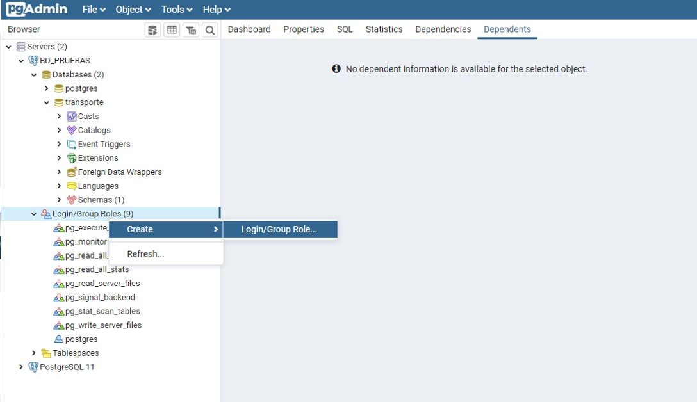

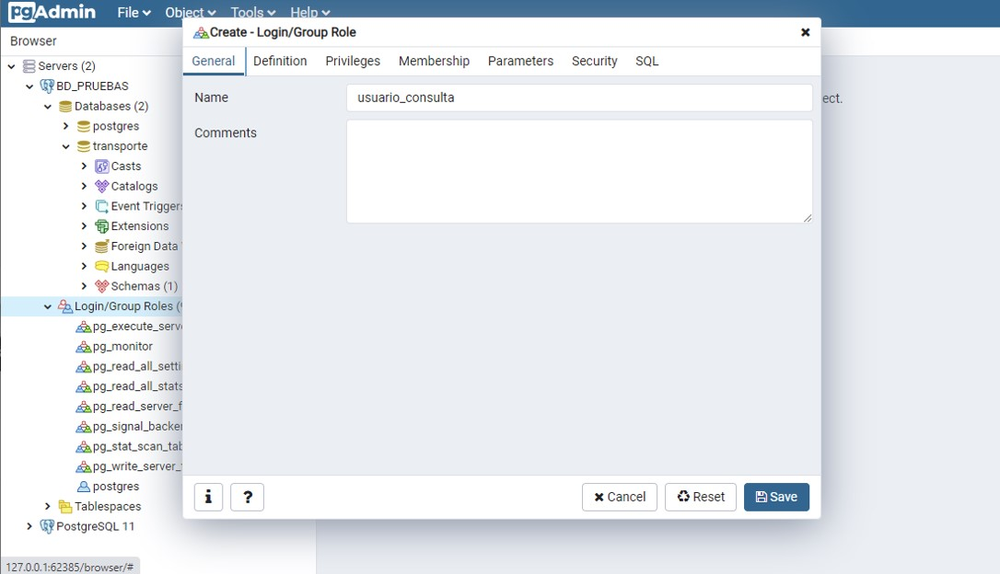

Asignamos un password

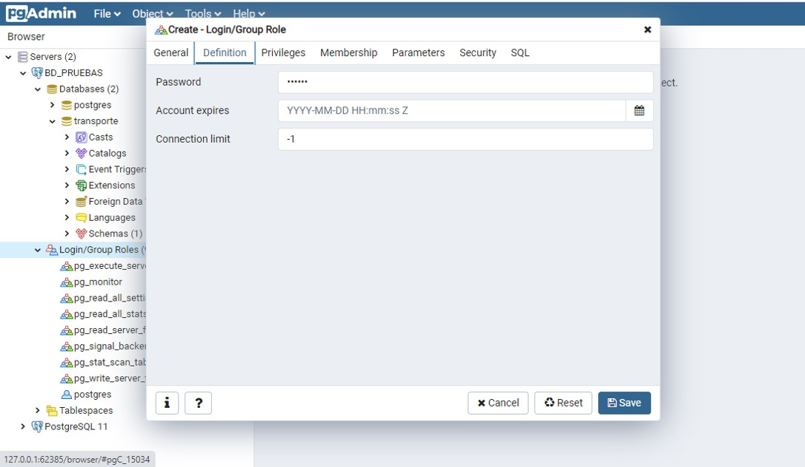

Asignamos permisos para solo lectura

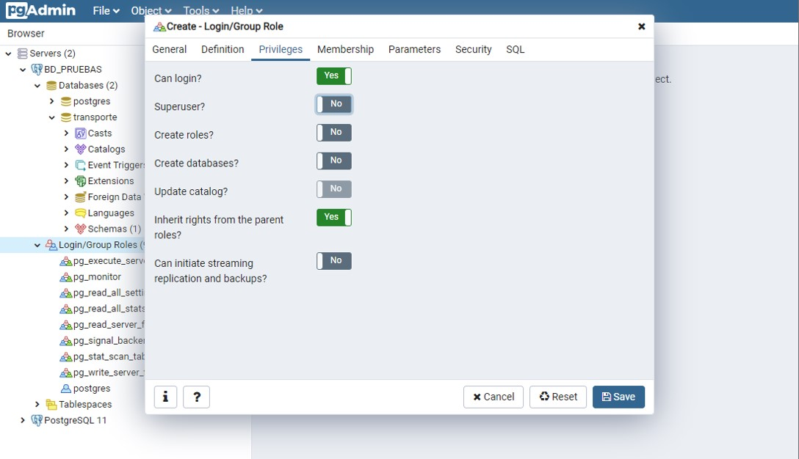

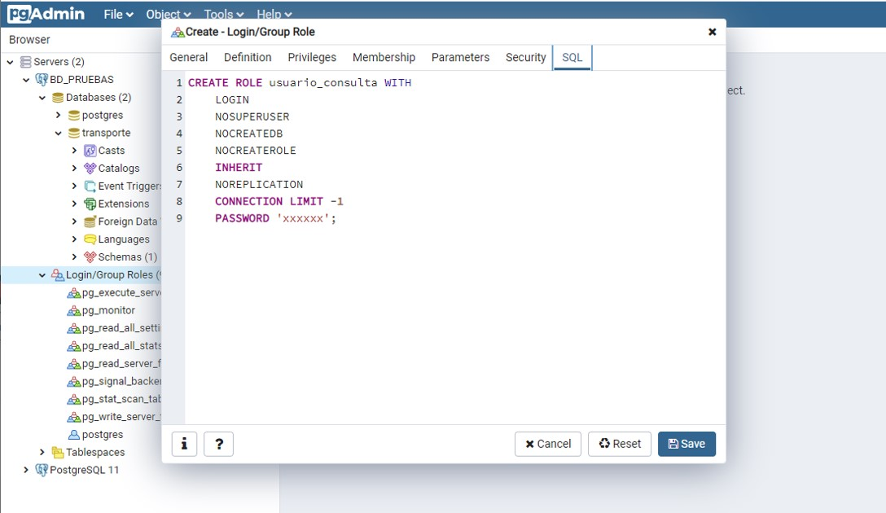

Ahora vamos a darle permisos a nuestras tablas para que el usuario_consulta pueda tener acceso a interactuar informacion y consultarla, este no podrá acceder a la estructura de la misma ni borrar informacion

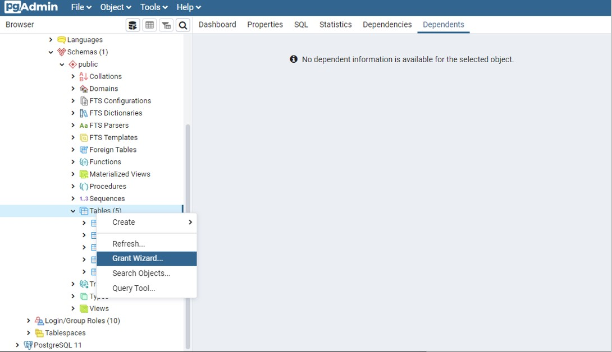

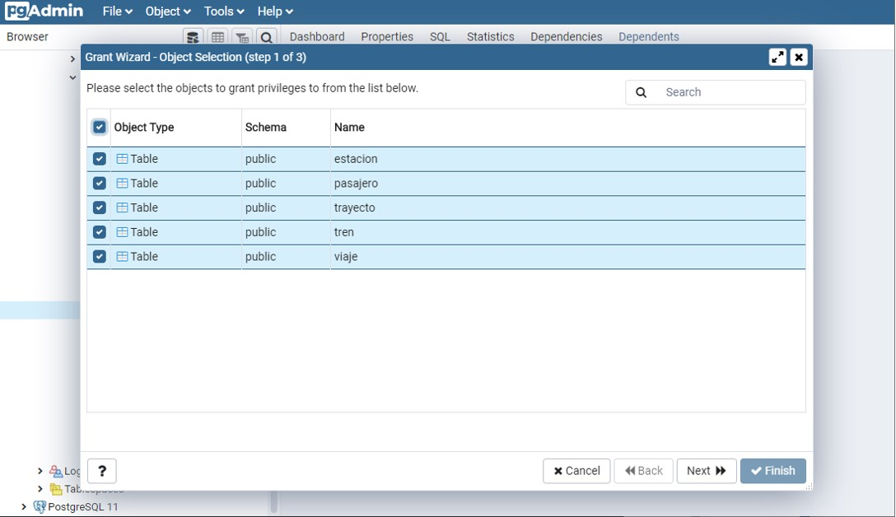

Damos click en next y seleccionamos los permisos que se otorgaran en este caso insert, select y update

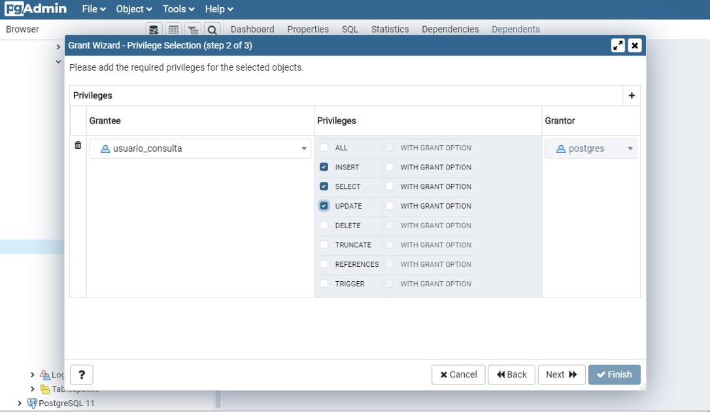


Verificamos que en las otras tablas.


### Clase 15 Llaves foraneas

Ya tenemos las tablas con sus llaves primarias, hemos creado los roles, ahora tenemos que crear las llaves foraneas estas hacen referencia a la informacion que existe entre las tablas y corresponde con nuestro ACID estándar en la parte de consistencia , es decir que todas las tablas corresponden entre si y la informacion es congruente.

Para ello tenemos que entender que las llaves foraneas siguen una estructura muy básica:

- Tabla de origen
- Tabla destino
- Acciones en caso de modificación en la tabla de origen

Vamos a definir la primer relacion con el trayecto y sus relaciones con las otras tablas, vemos en los constraints donde nos indica cual valor es una llave primaria y asegura que ese valor sea único, y a continuación damos click en Foreign Key para definir las relaciones con las otras tablas.


Damos click en el símbolo de + para que acepte los cambios, la pestaña de Action es la mas importante ya que se indica que acciones se llevaran a cabo cuando ocurra un cambio en la tabla principal.


A continuación creamos la relacion de trayecto con tren usando el Query Tool

```sql
ALTER TABLE  trayecto ADD CONSTRAINT trayecto_tren_fk FOREIGN KEY (id_tren)
REFERENCES public.tren (id) MATCH SIMPLE
ON UPDATE CASCADE
ON DELETE CASCADE
```


Aplicaremos lo mismo con la tabla de viaje


```sql
ALTER TABLE public.viaje
ADD CONSTRAINT viaje_trayecto_fkey FOREIGN KEY (id_trayecto)
REFERENCES public.trayecto (id) MATCH SIMPLE
ON UPDATE CASCADE
ON DELETE CASCADE

```


Comprobamos que los cambios se hayan realizado en la tabla.


### Clase 16 Insercion y consulta de datos

Vamos a insertar datos en la tabla estacion, para ello damos de nuevo click derecho en la tabla deseada, vamos al menu Scripts y después al apartado INSERT Script


Creamos dos INSERT


```sql
INSERT INTO public.estacion(
nombre, direccion)
VALUES ('Estacion Centro', 'St #2');
```

```sql
INSERT INTO public.estacion(
nombre, direccion)
VALUES ('Estacion Norte', 'St 00#2');
```

Y verificamos que se hayan insertado los datos


Insertamos la informacion de la tabla de trenes


A continuación viene la parte interesante que es relacionar la informacion de las tablas tren y estacion en la tabla trayecto.


En caso de querer agregar un tren o una estacion que no existe PGAdmin/la consola no informara acerca del tipo de error


Finalmente borramos la informacion de la tabla tren para el primer id


Ahora veamos el efecto en la tabla de trayectos


Observamos que se elimino la informacion (por la acción CASCADE) del trayecto ya que se elimino el id (llave primaria) del tren, ahora una peculiaridad es que si creamos otro tren sin definir explícitamente el valor del id tendremos un tren id 2, y el id del trayecto también cambiara.


Ahora que pasa si cambiamos el ID del tren? Eso lo logramos con el comando UPDATE o UPDATE Script de PGAdmin


### Clase 17 Insercion masiva de datos

Para esta clase usaremos el servicios <https://mockaroo.com/> para generar datos y después hacer las consultas y los temas avanzados de este curso.

El servicio es intuitivo, por lo que deben quedar los campos de la siguiente manera.


Hacemos click en el botón download y descargamos el script SQL, lo abrimos en nuestro editor de texto, copiamos y pegamos en el Script insert de estacion.

pero antes reiniciamos limpiamos las tablas

```sql
TRUNCATE estacion CASCADE;
TRUNCATE tren CASCADE;
TRUNCATE trayecto CASCADE;
TRUNCATE pasajero CASCADE;
TRUNCATE viaje CASCADE;
```

y reiniciamos el serial el serial de las tablas

```sql
TRUNCATE TABLE tren, trayecto, viaje, estacion, pasajero RESTART IDENTITY;
```


Ahora hacemos lo mismo para la tabla de trenes.


Creamos la data para trayecto y para viaje


## Modulo 3 Generar consultas avanzadas

### Clase 18 Cruzar tablas: SQL JOIN

Ya tenemos informacion en nuestra base de datos, ahora podemos implementar joins para unir las tablas y extraer informacion de valor, recordemos que los joins implementan toda la teoría de conjuntos, si vienes de un background con python los joins son iguales a los sets.

Los siguientes son los tipos de joins

- JOIN(INNER)
- LEFT(OUTER)
- RIGHT(OUTER)
- FULL OUTER


lectura recomendada  <https://www.postgresqltutorial.com/postgresql-joins/>

Consultas de la clase

```sql
-- Inner Join o join
select * from pasajero
join viaje on (viaje.id_pasajero = pasajero.id);

-- que pasajeros no han tomado ningun viaje
select * from pasajero
LEFT JOIN viaje on (viaje.id_pasajero = pasajero.id)
WHERE viaje.id IS NULL;
```


### Clase 19 Funciones Especiales Principales

Postgres tiene una lista de funciones especiales que están diseñadas exclusivamente para ayudarte a desarrollar tu aplicación mucho mas rápido algunas de ellas son:

- **ON CONFLICT DO:** Nos ayuda cuando queremos insertar o modificar los datos en una tabla que no podamos y justamente después hacemos la actualización correcta, es decir si queremos insertar un dato que ya existe un conflict do no permite hacer una actualización sobre el mismo dato.

- **RETURNING:** Nos permite devolver todos los cambios que hemos hecho sobre la base de datos, es decir si hacemos un insert nos devuelve todos los datos que fueron insertados en la base de datos, y si hay un campo de tipo serial devuelve el valor asignado.

- **LIKE/ALIKE:** nos sirve para hacer búsquedas al estilo de regex por ejemplo buscar nombres que comiencen con la letra o

- **IS/IS NOT:** nos permite comparar dos tipos de datos que no sean estándar como numérico y alfanumérico sino que sean de tipo objeto o especiales como Null, en este podemos saber por ejemplo si un campo es nulo o no lo es.

Veremos como hacer esto con PGAdmin.

Primer Ejemplo: Insertar un dato en la tabla estacion con id = .

**ON CONFLICT DO NOTHING**.


```SQL
INSERT INTO public.estacion(
id, nombre, direccion)
VALUES (, 'Nombre', 'Dire')
ON CONFLICT DO NOTHING;
```

**ON CONFLICT (COLUMNA) DO UPDATE SET**.


```SQL
INSERT INTO public.estacion(
id, nombre, direccion)
VALUES (, 'Nombre', 'Dire')
ON CONFLICT(ID) DO UPDATE SET nombre = 'Nombre', direccion = 'Dire';
```

**RETURNING**.


```SQL
INSERT INTO public.estacion(
nombre, direccion)
VALUES ('RET', 'RETDRI')
RETURNING *;
```

**LIKE**.


```SQL
SELECT nombre
FROM public.pasajero
WHERE nombre ILIKE 'o%';

-- % buscar 1 o cualquier valor
-- _ buscar solamente 1
-- I buscar mayus o minusc por igual
```

****IS/IS NOT:****.


```SQL
SELECT *
FROM public.tren
WHERE modelo is NULL;
```

### Clase 20 Funciones Especiales Avanzadas

Funciones mas comunes en postgres:

- **COALESCE:** permite comprar dos valores y retornar cual de los dos no es nulo

- **NULLIF:** permite comparar dos valores y retorna Null si son iguales
  
- **GREATEST:** permite comprar un arreglo de valores y retorna el mayor

- **LEAST:** permite comprar un arreglo de valores y retorna el menor

- **BLOQUES ANÓNIMOS:** permite ingresar condicionales dentro de una consulta de base de datos.

**Ejemplo COALESCE**.

Primero modificar tabla pasajero para tener un dato como nulo.


```sql
SELECT id, COALESCE(nombre, 'No Aplica') nombre, direccion_residencia, fecha_nacimiento
FROM public.pasajero WHERE id = 1;
```

**Ejemplo NULLIF**.


```sql
SELECT NULLIF (0,0);
```

**Ejemplo GREATEST**.


```sql
SELECT GREATEST (0, 1,2,3,4,5,6);;
```

**Ejemplo LEAST**.


```sql
SELECT LEAST (0, 1,2,3,4,5,6);;
```

**Ejemplo BLOQUES ANÓNIMOS**.


```sql
SELECT id, nombre, direccion_residencia, fecha_nacimiento,
CASE --inicia bloque anónimo
WHEN fecha_nacimiento > '2015-01-01' THEN
'niño'
ELSE
'Mayor'
END --termina bloque anónimo
FROM public.pasajero;
```

**Reto:** Consultar la informacion de los pasajeros agregando una columna adicional que nos diga quienes comienzan su nombre por la letra O y tiene mas de 18 años.

```sql
SELECT id, nombre, direccion_residencia, fecha_nacimiento,
CASE
--inicia bloque anónimo
   WHEN nombre ILIKE 'o%' THEN '1'
   ELSE '0'
END as nombre_inicia_o,
--termina bloque anónimo
CASE
--inicia bloque anónimo
   WHEN EXTRACT(YEAR FROM current_date)- EXTRACT(YEAR FROM fecha_nacimiento) <= 18 THEN
   'Mayor de 18 años'
   ELSE
   'Menor de 18 años'
END as Mayoria_de_edad
--termina bloque anónimo
FROM public.pasajero;
```

### Clase 21 Vistas

Cuando necesitamos extraer la informacion de una base de datos en forma de consulta muchas veces como por ejemplo para generar reportes es conveniente utilizar las vistas, existen dos tipos.

- Vista: Volátil (trae informacion reciente)

- Vista Materializada: Persistente (trae informacion de memoria con la ultima consulta  histórica)

Cuando la construimos usaremos la sintaxis SELECT vista

#### Vista volatil

Creamos la vista en PGAdmin dando click derecho en views y luego en create


```sql
SELECT *,
CASE
WHEN fecha_nacimiento > '2015-01-01' THEN
'Mayor'
ELSE
'niño'
END as tipo
FROM public.pasajero
ORDER BY tipo;
```


Guardamos la vista y ahora hacemos la consulta


Estas vistas volatiles son muy útiles ya que podemos pasar la consulta raw (haciendo referencia a django) a nuestro backend para entregar el estado actual de los datos de nuestra aplicación.

#### Vista Materializada

Para ello hacemos click derecho en Materialized Views y seguimos los pasos del ejemplo anterior.

```sql
SELECT * from viaje WHERE inicio > '2020-01-01';
```

Nota: El ejemplo del curso utiliza horas, en mi caso particular utilice fechas.

Hacemos la consulta


Y observamos el error de que la vista no cuenta con datos, por lo que procedemos a aplicar la sentencia recomendada.


Si borramos algún registro de nuestra tabla de viaje (29 al inicio 28 al borrar) la vista materializada seguirá conteniendo el total original (29 registros), estas vistas las usamos cuando queremos obtener la informacion 1 vez, esta quedara guardada en memoria.

### Clase 22 PL/SQL

Las PL o procedimientos almacenados hacen parte del motor de postgres y es una de las caracteristicas mas importantes y el porque las personas empiezan a usar este motor, ella nos ayuda a desarrollar código directamente sobre la base su estructura es bastante sencilla, se asemeja a una funcion de cualquier lenguaje de programación (declaración, uso de variables y un fin) y se permite ejecutar dentro de la base de datos.


#### Creando funciones con PL

El primer ejemplo declara una PL nota que todas las PL inician con DO $$ y terminan con $$, este ejemplo levanta un mensaje solamente en la consola, esto con el keyword  **RAISE NOTICE**


Segundo ejemplo usando variables y tipos de datos, esto se hace con la seccion **DECLARE**, **record** nos permite almacenar el tipo de dato de una fila, y si queremos un valor de inicio lo hacemos con ":=" en el lenguaje de postgres y "=" solo esta reservado para las consultas.


Ahora contaremos los registros en la tabla incorporando un contador


Como te habrás dado cuenta no es posible llamar a este PL de esta manera, para ello es necesario encapsularlo de la siguiente forma.


Void indica que no retorna valores, para ejecutar nuestra funcion basta con usar lo siguiente

```sql
SELECT importantePL();
```


No retorna ningun dato, pero si los mensajes de lo que ejecutamos.


Si queremos retornar algún dato lo podemos declarar después de **RETURNS** y muy importante como nuestra funcion ya existe debemos hacer uno de la expresión **CREATE OR REPLACE FUNCTION** para nuestra funcion importantePL()


**tip: La mayoria de las PL tienen que ver con consultas**.

#### Creando funciones con PGAdmin

Al igual que los demás ejercicios en el arbol del menu damos click derecho en functions y después en CREATE

Nombramos a nuestra funcion


Guardamos la PL y la ejecutamos igual que la forma anterior a traves del select.


### Clase 23 Triggers

Los Triggers son herramientas muy útiles que nos permiten ejecutar funciones dependiendo de acciones que se ejecuten sobre una tabla, esa acciones pueden ser:

- INSERT
- UPDATE
- DELETE

Veremos con PGAdmin como concatenar nuestra pl a una funcion de INSERT, UPDATE O DELETE de la tabla de pasajeros.

Crearemos ua bitacora que nos apoye a la clase, para ello haremos una tabla de nombre "cont_pasajero" con dos columnas "total" con valor integer y "tiempo" en formato time with time zone y una pk  de nombre id (si tienes dudas revisa la primer seccion de las notas).

Ahora la tabla la modificaremos unicamente con la PL que acabamos de crear.

Primero modificamos la ultima PL en las propiedades/code

```sql
DECLARE
 rec record;
 contador integer := 0;
BEGIN
  FOR rec IN SELECT * FROM pasajero LOOP
-- accedes con dot notation a las propiedades de la variable rec
RAISE NOTICE 'Un pasajero se llama % con el id %',  rec.nombre, rec.id;
contador := contador + 1;
  END LOOP;
  INSERT INTO cont_pasajero (total,tiempo)
  VALUES (contador, now());
  RETURN contador;
END
```

Ejecutamos nuestra PL y traemos los datos de la ultima tabla creada


Borramos un registro de la tabla de pasajeros, volvemos a ejecutar nuestro trigger y consultamos de nuevo los datos.


Ahora  vamos a hacer que esa funcion sea de tipo Trigger y la adjuntamos al insert de la tabla de pasajeros.

Para ello modificamos la funcion, donde ahora deberá detornar un trigger, para ello borramos la funcion que teníamos y la volvemos a escribir.


Ese trigger de cierta forma lo podemos adjuntar a las acciones sobre una tabla, las acciones compatibles son INSERT, UPDATE, DELETE Y TRUNCATE, para este ejemplo vamos a hacerlo sobre el nivel de INSERT para ello creamos la funcion CREATE TRIGGER


Intentamos hacer un insert a pasajeros.


Observamos en el error que el trigger no esta retornando nada, por lo que hay que modificarlo en el apartado del arbol triggers lo buscamos y damos click en CREATE y modificamos el trigger.

Un trigger contiene informacion de lo que se esta cambiando debemos confirmar al motor de la base de datos si el cambio se esta llevando a cabo o no.

Los triggers tiene dos variables globales muy importantes **OLD** lo que estaba antes del cambio y **NEW** lo que esta después del cambio, si queremos que el trigger proceda con el nuevo valor usamos NEW, si queremos quedarnos como estábamos usamos OLD, al igual que la variable rec también podemos acceder a las propiedades con dot notation asi tendremos OLD.id o NEW.nombre donde se almacenan los cambios en el estado, estas tienen mucho sentido cuando hacemos un UPDATE, pero para insert lo adecuado siempre sera NEW.

Seguiremos los siguientes pasos

1 Borramos el Trigger

2.- Borramos la funcion en CASCADE para eliminar el disparador también.

```sql
DROP  FUNCTION public.importante_pl2() CASCADE ;
```

3.- Creamos el trigger


```sql

CREATE FUNCTION public.importante_pl2()
    RETURNS trigger
    LANGUAGE 'plpgsql'
    COST 100
    VOLATILE NOT LEAKPROOF
AS $BODY$
DECLARE
 rec record;
 contador integer := 0;
BEGIN
  FOR rec IN SELECT * FROM pasajero LOOP
    contador := contador + 1;
  END LOOP;
  INSERT INTO cont_pasajero (total,tiempo)
  VALUES (contador, now());
  RETURN NEW;
END
$BODY$;
```

4.- Creamos el Trigger


Ahora procedemos de nuevo a insertar un valor nuevo en la tabla pasajero


Consultamos la tabla cont_pasajeros para confirmar


**Reto:** Crear un trigger similar al anterior donde se registre cuando se eliminan los pasajeros

**Solución**.

Funcion pl_on_delete_pasajero

```sql
CREATE FUNCTION public.pl_on_delete_pasajero()
    RETURNS trigger
    LANGUAGE 'plpgsql'

AS $BODY$
DECLARE
 rec record;
 contador integer := 0;
BEGIN
  FOR rec IN SELECT * FROM pasajero LOOP
    contador := contador + 1;
  END LOOP;
  INSERT INTO cont_pasajero (total,tiempo)
  VALUES (contador, now());
  RETURN NEW;
END
$BODY$;
```

Se crea Trigger con la funcion, el nombre del trigger lo encuentras en los triggers de la tabla pasajero.

```sql
CREATE TRIGGER mitrigger_2
    AFTER DELETE
    ON public.pasajero
    FOR EACH ROW
    EXECUTE PROCEDURE pl_on_delete_pasajero();
```

Verificamos haciendo el DELETE de cualquier usuario y observamos el resultado.


## Modulo 4 Integrar bases de datos con servicios externos

### Clase 24 Simulando una conexion a Bases de Datos remotas

Postgres ofrece un servicio llamado **dblink**, permite conectarte a servidores remotos dentro de una consulta, en el cual puedes hacer **SELECT** una tabla local y hacer incluso un **JOIN** a una base de datos remota.

Para ello crearemos una base de datos en nuestro propio servidor simulando que sea una base de datos remota siguiendo los pasos que ya conocemos y la denominamos como "remota" con una tabla llamada vip, esta tendra dos columnas ID (serial) y Fecha (date), finalmente le damos todos los permisos al usuario que se conectara a la base de datos en forma remota en este caso nuestro **usuario_consulta**.

Insertamos un par de datos para probar.

```sql
INSERT INTO public.vip(
    id, fecha)
    VALUES (50, '2010-01-01');
```

Y nos desconectamos de esa base de datos para conectarnos después desde la tabla pasajero de la base de datos transporte.

Antes de todo verificamos tener instalado dblink

```sql
SELECT * FROM
dblink ('dbname=remota
         port=5432
         host=127.0.0.1
         user=usuario_consulta
         password=etc123'
         'SELECT id, fecha FROM vip')
```

Al ejecutar obtendremos un error si no tenemos instalado db link, lo instalamos con lo siguiente

```sql
CREATE EXTENSION dblink;
```

Volvemos a  intentar la conexion.


Ya obtuvimos acceso remoto a una base de datos, ahora hagamos un join de nuestros datos locales para saber quien es el usuario VIP

```sql
SELECT * FROM pasajero
JOIN
dblink ('dbname=remota
         port=5432
         host=127.0.0.1
         user=usuario_consulta
         password=etc123',
         'SELECT id, fecha FROM vip'
) as datos_remotos (id integer, fecha date)
ON (pasajero.id = datos_remotos.id);
```

Usamos **USING** cuando los dos campos de una consulta **JOIN** son iguales, esto es especial de las consultas esto nos devuelve la misma informacion de la tabla

```sql
SELECT * FROM pasajero
JOIN
dblink ('dbname=remota
        port=5432
        host=127.0.0.1
        user=usuario_consulta
        password=etc123',
        'SELECT id, fecha FROM vip'
) as datos_remotos (id integer, fecha date)
-- ON (pasajero = datos_remotos)
USING (id);
```


**Reto** Haz la conexion de forma inversa.

**Solución**.

```sql
SELECT * FROM vip
JOIN
dblink ('dbname=transporte
         port=5432
         host=127.0.0.1
         user=usuario_consulta
         password=etc123',
         'SELECT id, nombre, direccion_residencia, fecha_nacimiento FROM pasajero'
    )  as datos_remotos (id integer,
                         nombre character varying,
                         direccion_residencia character varying,
                         fecha_nacimiento date)
-- ON (vip.id = datos_remotos.id)
USING (id)
;
```


### Clase 25 Transacciones

Tomando el ejemplo de un cajero automático, cuando uno de sus procesos falla este debe devolver todos los cambios, postgres hace lo mismo, cuando tiene un proceso si alguna de las tareas que lo componen falla este debe poder devolver todos los cambios automáticamente (hacer un rollback)

El proceso se ilustra como

```md

BEGIN
<Consultas>
COMMIT (si todo salio bien) | ROLLBACK (si algo salio mal)
```

En PGAdmin primero desactivamos el auto commit, este viene activo por default, y ejecutamos las siguientes consultas iniciando con **BEGIN**


Como puedes observar (y marcado con un recuadro naranja) en la interfaz de PGAdmin aparecieron 2 botones "commit" y "rollback" si damos commit deben guardarse los datos, y en el caso opuesto deshacer la transacción, pero como esta es una consulta esto no afecta a la base de datos.

Ahora probemos que pasa con un insert creando una nueva estacion.


En este punto la informacion esta almacenada en memoria, si quitamos el comentario de algunas de las opciones (no es necesario ejecutar los inserts ya que los datos están en staging) y ejecutamos esa linea se confirmaran o devolverán los cambios, también lo puedes hacer en forma manual con los botones de la interface, aceptamos los cambios y comprobamos la informacion insertada.


Hasta ahora todos los datos han sido correctos y el commit se ejecuta sin problemas, ahora haremos un ejemplo usando un id que se encuentra repetido usando un INSERT.


Al ejecutar los inserts dentro del bloque de código **BEGIN / COMMIT** nos aseguramos que todas las operaciones sean congruentes, si hubiésemos ejecutado las sentencias con la selección  la primera se habría ejecutado y guardado, y la segunda hubiera fallado, pero al estar dentro del bloque de transacción con una consulta que sea errónea se hace el **ROLLBACK** y no se guarda ninguna informacion en la base de datos, ya que postgres siempre lo hace de manera implícita sin mostrarlo en pantalla, una forma explicita seria usándolo con las PL para limitar el numero de vip's en nuestros servicios.


### Clase 26 Otras Extensiones para Postgres

Postgres tiene muchas extensiones pre-instaladas pero no activas en tu sistema operativo, y estas te sirven para hacer cálculos, análisis, prototipado inclusive para machine learning.

Activaremos una funcion que te permite comprar dos palabras letra por letra y como suenan cuando se pronuncian en Ingles, todo usando PGAdmin.

Aquí todas las extensiones disponibles <https://www.postgresql.org/docs/11/contrib.html>

Vamos a PGAdmin para instalar leveshtein (la funcion matemática para medir la distancia entre dos palabras)

**Levenshtein**.


Vemos el resultado es 1, es decir el numero de caracteres que es necesario cambiar para que ambas palabras sean iguales.

**Difference**.

Esta funcion es utilizada junto con algoritmos de machine learning y procesamiento de lenguaje natural el cual sabe que palabra quisiste decir, nos entrega un valor entre 0 y 4 donde 0 diferencia amplia.


Estas dos funciones si nuestra aplicaciones implementan análisis de texto o análisis de voz no es necesario desarrollarlas desde cero ya que postgres lo implementa al nivel de la base de datos.

## Modulo 5 Implementar mejores prácticas

### Clase 26 Backups y Restauracion

Ha llegado el momento de guardar todo nuestro trabajo hasta el momento y tener una copia de seguridad en caso de que algo catastrófico ocurra, para eso Postgres tiene los servicios de restauracion, usaremos los siguientes comandos

- pg_dump
- pg_restore[psql]

Tenemos nuestra base de datos con mucha informacion delicada, y vamos a crear una copia de seguridad, para ello vamos en PGAdmin a nuestra base de datos **"transporte"** haciendo click derecho y seleccionamos la opcion Backup... y se abrirá un formulario para preguntarnos que es lo que queremos hacer.


Tenemos los siguientes campos:

- **Filename:** Para indicar el nombre de tu archivo  y el icono con tres puntos nos abre una ventana para seleccionar el directorio donde queremos guardar la  el backup

- **Format:** Este tiene 4 opciones.
  - custom: Solo se puede usar con PGAdmin.
  - Tar: archivo comprimido .tar que contienen la estructura de la base de datos.
  - plain: sql plano, tendrás toda la informacion como una gran query con las sentencias (create table, insert, etc) y los datos.
  - Directory: tiene la estructura sin comprimir de la base de datos.

- **Compression ratio:** el numero de veces que se ejecuta  el ciclo de compresión para que quede un archivo mas pequeño.

- **Encoding:** La codificación de la base de datos por ejemplo UTF-8.

- **Number of jobs:** no lo podemos modificar, lo define PGAdmin.

- Role name: Dueño de quien sera el DUMP.

En la pantalla de opciones podemos solicitar la data y el schema, o solo uno de ellos, los blobs se refiere a los datos de tipos binarios (imagen o archivo de texto), haz click en el símbolo ? para ver a detalle cada una de las opciones.


Ahora para realizar el paso de Restauracion creamos una base de datos nueva (simulando que ya no existe la base transporte), damos click derecho y seleccionamos la opcion de Restore.


Con ello recuperamos nuestras tablas y la informacion que estas contenían.

**Nota:** es importante resaltar que cuando se hace un backup para ser restaurado en una versión diferente se debe de usar la opción plana dado que el custom varia de versión a versión.

Como hacer backup desde la consola

Crear un fichero con las sentencias SQL listas para cargar el contenido de
una db en otra db distinta (modo simple)

```sql
postgres=# pg_dump source_db_name > db_data.sql
```

Cargar un fichero con las sentencias SQL listas de una db en otra db
nueva y distinta (modo simple)

```sql
postgres=# psql -d new_db_name -f db_data.sql
```

Otras opciones disponibles:

```sql
postgres=#\q
...$ psql --help
```

### Clase 29 Mantenimiento

Este es un tema importante y que postgres realiza por debajo en segundo plano, en este proceso de vacuum (vaciado) quita todas las filas, columnas e items del disco duro que no están funcionando para optimizar los servicios.

Postgres tiene dos niveles de limpieza.

- Liviano: se ejecuta todo el tiempo para lograr las optimizaciones descritas anteriormente.

- Completo (full): que es capaz de bloquear las tablas para hacer la limpieza y luego las desbloquea, es importante cuando tenemos una tabla muy grande y tenemos problemas de indexacion.

El mantenimiento en PGAdmin lo llevamos a cabo dando click derecho sobre la base de datos o sobre una de las tablas, pero es muy diferente ya que solo afectamos una tabla, mientras a nivel de base de datos podemos llegar a bloquear todas las tablas hasta que la tarea de mantenimiento termine, este es su menu con sus caracteristicas, la mas importante es vacuum.


- Full: quiere decir que la tabla que vas a limpiar (en este caso estacion) quedara limpia en su totalidad, es decir se realizara la revision de todo el espacio en memoria para que todas las filas que ya no son aplicables se eliminen y todos los indices también.

- Freeze: incluye que durante ese proceso se va a congelar, pero hay que tener en cuenta que un cuando se hace un vacuum full si no es posible hacerlo en lo que llega una consulta nueva esa tabla queda congelada y tendra un lot quiere decir que ninguna tabla podrá acceder a ella hasta que termine el proceso de limpieza.

- Analyze: ejecuta una revision pero no hace cambios en la tabla.

- Verbose Messages. Nos da el feedback de lo que esta sucediendo.

- Reindex: aplica para tablas que tienen indices, entre ellos las llaves primarias, que los motores crean como indices porque son normalmente usados para búsquedas.

- Custer: es decirle al motor de la base de datos que reorganice la el almacenamiento.

Estas 4 opciones no es recomendable hacerlo a mano ya que postgres tiene mas de 20 años optimizando estos procesos, aunque eventualmente si puede llegar a ser necesario hacerlo hazlo en un horario que no afecte a tus usuarios o servicios.

### Clase 29 Introduccion a Replicas

Las replicas son mecanismos que nos permiten evitar problemas  de entrada y salida en los sistemas operativos.

Ten en cuenta esta frase.


Cuando tu aplicación crece en usuarios/operaciones te vas a topar con limites en términos de física y electronica, es decir los recursos de tu servidor (disco, ram, cpu) tienen limites, ellos no pueden ser sobrepasados en sus procesos de lectura y escritura que no pueden llevarse al mismo tiempo, por este motivo postgres bloquea la tabla para escritura mientras la lees y viceversa, esto para conservar la consistencia de datos, aquí entran las replicas a solucionar este problema.

**Estrategia de Replicas**.

Tendremos la base de datos principal se hacen todas las modificaciones y tener una base de datos secundaria donde solamente se hacen las lecturas, separa las acciones nos permite separar todas las tareas que hace internamente postgres es decir los cambios los hace en "A" y  automáticamente se llevan a la tabla donde se leen los datos "B", este proceso lo hace postgres no tiene que hacer nada a mano, solamente es necesario configurar al menos 2 servidores de postgres (por lo menos 2, ya que puedes tener una cantidad ilimitada de replicas) uno como maestro y otro como esclavo, deberás modificar tu aplicación para que todas las modificaciones las haga sobre la base de datos principal o "master" y que todas las lecturas las haga sobre la replica (copia en caliente de la base de datos).

IPS (In operation per second) es la limitante a nivel de sistemas operativos, como saber que nivel nos sirve (10,20, 40 iops)

### Clase 30 Implementacion de Replicas en Postgres

Usaremos la plataforma <https://jelastic.com/>  para crear dos servidores 1 de postgres que sera el maestro y 1 en postgres que sera el esclavo/replica, jelastic es un SaaS

Primero nos registramos aquí <https://app.cloudjiffy.co/>, nos registramos y creamos dos bases de datos hacemos lo mismo para master1 y replica1.


Esperamos a que termine su proceso y recibiremos por email los datos de conexion para usar en PAAdmin donde crearemos un servidor como los locales, lo nombramos master, pero en los datos de host y password utilizaremos los datos que recibimos por correo ya que IPV4 ya no esta disponible en la version trial, para la parte del nodo debemos ir al servicio de jelastic y dar click en el engrane amarillo a la altura de la base de datos y configurar un endpoint y reemplazar ese dato en el puerto.

Datos del correo


Configurar endpoint


**Aquí ATENTO es muy importante que selecciones el nodo de tu base de datos** (tuve el error de seleccionar el nodo del server y nunca me conecte) la imagen es solo referencia, el nodo lo encuentras en el apartado con el icono de Postgres.


Después de hacer clic en ADD nos asigna el Port que Podemos usar para accede a la BD usando el host en forma de nombre de dominio y no IP, en éste caso fué 11031. 


Este proceso lo realizamos también para la base replica, bien ahora contamos con dos bases de datos independientes.


#### Configuracion Master

Ahora vamos a configurar ambas bases de datos, una como maestro y la otra como esclavo.

Primero vamos a configurar master, aplicaremos cambios al archivo **postgresql.conf** cambiando varios parámetros para que entienda que va a ser una base de datos de replica y que va a recibir conexiones desde otra base de datos para copiar informacion.

Buscamos los siguientes campos

- **wal_level**(wall ahead log) que es como la bitacora de la base de datos, lo establecemos en para que se comporte en modo **hot_standby**, es decir una base de datos que mantiene sus archivos hasta que sus replicas se las lleven y los ejecuten.**Básicamente las replicas funcionan leyendo estos archivos de bitacora y copiando la informacion para no bloquear la base de datos maestra;**


Buscamos el parámetro **max_wal_senders** que corresponde a la cantidad de replicas que vamos a tener, lo dejamos como 2 a futuro.


Siguiente parámetro es **archive_mode** y refiere a como vamos a guardar los archivos de esa bitacora, indica que no los vamos a eliminar sino simplemente a archivar, lo dejamos en **on** para que als copias de replica las puedan leer desde ahi.


Por ultimo para master tenemos **archive_command**, le indicamos con un comando de linux que es para copiar archivos y dejarlos en una carpeta temporal **'cp %p /tmp/%f'**


Con esto tenemos la configuracion principal en nuestra base de datos maestra, ahora reiniciamos el servicio, pero antes recuerdas que existe en un archivo para permitir la conexion remota entre servicios **pg_hba.cong**, agregaremos la siguiente configuracion para un host con intenciones de replicacion con todas las bases de datos se va a conectar desde una Ip y confiarle lo que haga sin contraseña (solo para estos efectos de practica, y usaremos la IP interna de la replica) y le ponemos la mascara 32 para que sepa que no es un rango de ips sino una sola ip


Ahora reiniciamos el nodo de postgres.

#### Configuracion Replica

Procedemos a los cambios para ello haremos un par de ajustes en el archivo.conf lo primero es copiar todo lo que esta en master, nos conectamos con shh en el icono de terminal


Ejecutamos el siguiente comando para detener el servicio de replica y hacer la copia de seguridad de los archivos directamente de la master hacia la esclava, con esto tendremos a las dos en un estado idéntico y posterior la reiniciamos en modo replica

Detenemos el servicio

```bash
sudo service postgresql stop
```

Borramos los datos existentes

```bash
 rm -rf /var/lib/pgsql/data/*
```

Copiamos los datos de por conexion remota

```bash
pg_basebackup -U webadmin -R -D /var/lib/pgsql/data/ --host=192.168.6.255 --port=5432
```

Ahora hacemos un cambio en la en el archivo **postgresql.conf** de la base de datos replica al parámetro **hot_standby**  lo indicamos en **on**


Ahora reiniciamos el servicio

```bash
sudo service postgresql start
```

Ahora lo interesante, comprobamos la configuracion maestro/replica, pero primero debes actualizar la contraseña de replica que ahora es la de master dado que clonamos sus datos, ahora si podemos acceder dado que tenemos una misma configuracion.

Creamos una base de datos en master


Unos segundos después y de manera automática, ya la tengo en replica


Pero si nosotros intentamos escribir en replica no nos va a dejar ya que replica es solo de lectura.

### Clase 31 Otras buenas  Practicas

**Problema:** Evitar bloqueos por inserciones y borrados en la misma tabla.

**solución:** renombrar tablas, decirle a sistema que ataque dos tablas, ejemplo con un **ALTER TABLE** cambia la tabla **viajes** a **viajes_temporal** y crea una tabla de **viajes "nueva"** mientras que la aplicación sigue utilizando la tabla de viajes para insertar las operaciones del dia/turno, esto permitirá a tu algoritmo de consolidación realizar el borrado y indexado mucho mas rápido, mientras la tabla viajes sigue con registrando las operaciones de la aplicación, esta operación se realiza dependiendo el flujo de informacion a consolidar.